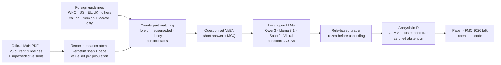

# Whose Standard of Care?

**Auditing how large language models deviate from Vietnamese Ministry of Health guidelines — and tracing each error to a named foreign guideline, an outdated Vietnamese version, or no recorded source.**

[](https://github.com/bminhnemhoi/HoiNghiFMC2026_PhanChauTrinhUni/actions/workflows/tests.yml)


-276DC3)
-555)

🇻🇳 [Phiên bản tiếng Việt](README.vi.md)

---

## Why this project

Students and clinicians increasingly ask LLMs for doses, thresholds and first-line drugs. In Vietnam the professional reference is the **current diagnosis-and-treatment guideline of the Ministry of Health (MoH)**. LLMs are trained mostly on foreign material, so an answer may silently follow a WHO, US or European value, or an MoH version that has since been replaced. Such an answer looks plausible, because the number is real somewhere.

This project builds a reproducible **audit method**:

1. extract every recommendation with a concrete value from official MoH PDFs (verbatim quote and page);
2. attach **comparison values**: named, versioned foreign guideline values, superseded MoH values, and a pre-specified **decoy** (a false value that estimates chance matches);
3. ask local open LLMs in Vietnamese and English under controlled conditions;
4. grade every answer with **pre-registered, rule-based** value comparison, and classify each error by source;
5. test whether foreign-guideline matches exceed the chance (decoy) level, and whether giving the model the MoH text fixes the error.

It also studies **certified abstention**: can a label-free disagreement signal flag high-risk answers with a statistical error guarantee?

> Scope: this is a measurement study. It does not build a prescribing tool, and it does not judge which guideline is medically "better": the target behaviour is fidelity to the current Vietnamese standard, ideally with awareness of where it differs from foreign guidelines. **Nothing in this repository is intended for clinical decision-making.**

## Research questions (pre-registered)

| | Question | Confirmatory hypothesis |
|---|---|---|
| **RQ1** Measurement & source tracing | When asked explicitly "according to the MoH", how often do models answer conflict recommendations with a foreign or outdated value? | **H1 (primary):** in Vietnamese with the MoH cue, foreign-value matches exceed decoy matches. **H2:** asking in English raises US-guideline matches. |
| **RQ2** Mechanism | Does context (retrieval, the exact passage, the whole chapter) remove the deviation? | **H3:** even with the exact passage, foreign/outdated answers stay > 5% for at least half of the open models. |
| **RQ3** Control | Does a label-free disagreement signal separate high-risk answers, with certified error at fixed coverage? | **H4:** the disagreement group has at least twice the risk of the agreement group. |

Prompt conditions: **A0** no country cue · **A1** "according to the current MoH guideline" (primary) · **A2** RAG over the MoH corpus · **A3** the exact guideline passage · **A4** the whole chapter. Answer labels, in fixed priority: correct and context-aware → correct (MoH) → outdated version → foreign guideline → no recorded source → no value.

## How it works



Every number that appears in the abstract or the paper is written by analysis code into a registry (`results/numbers.json`) and inserted into the text as `{{key}}`; a check refuses hand-typed numbers.

## Pilot results (completed, September 2026)

Pilot on **61 purposively selected recommendations** (of 65) from **12 MoH documents in force**; one small open model (**Qwen3-8B**, 4-bit, run locally on a laptop); short answers in Vietnamese and English under A0, A1 and A3. Grader 1.2.0 was frozen before the model outputs were unsealed.

| Setting (conflict group, n = 20) | Correct | Notes |
|---|---|---|
| Vietnamese, no country cue (A0) | 2/20 | |
| Vietnamese, MoH cue (A1) | **7/20** (35.0%; 95% CI 15.4%–59.2%) | 2 matched a foreign value, 7 no recorded source, 4 unreadable by the rule grader; sensitivity analysis with AI-adjudicated labels: 8/20 |
| Vietnamese, exact passage (A3) | 13/20 | vs A1: 9 wrong→correct, 3 correct→wrong (exploratory McNemar p = 0.15) |
| English, A0 / A1 / A3 | 3/20 · 5/20 · 13/20 | A1 vs A3 exploratory McNemar p = 0.02 |

- Foreign vs decoy matches (15 conflict recommendations with a decoy, Vietnamese, A1): **2 vs 0** → foreign defaults were *not shown* to exceed the chance level.
- Concordant group (MoH = foreign values): 9/21 correct with the MoH cue; 19/21 with the passage.
- Rule grader vs AI-adjudicated labels on short answers: 89.5% agreement (95% CI 86.0%–92.3%), κ = 0.83.

**Reading:** for this small model most errors match *no recorded source*; supplying the MoH text helps but does not remove errors. Limitations: hand-picked sample, one model, **all checks done by AI (Claude), no clinician review**. Details: [`results/pilot/pilot_summary.md`](results/pilot/pilot_summary.md), conference abstract in [`Nop_Final_PhanChauTrinh_HT2026/`](Nop_Final_PhanChauTrinh_HT2026/).

## Current status

| Work package | Status |
|---|---|
| Pilot + FMC 2026 abstract (VI/EN, conference template) | ✅ done; submission by the author (deadline 30 Sep 2026) |
| Guideline corpus: 25 current MoH guidelines + supersession chains | ✅ done ([`review/supersession_check.md`](review/supersession_check.md)) |
| Pre-registration draft (OSF) | ✅ drafted ([`prereg/`](prereg/)); submission by the author (deadline 7 Oct 2026) |
| Main-study atom extraction | 🟡 45/62 page chunks, 10,903 raw atoms; independent audit pending |
| Versioned foreign reference store | 🟡 10/12 disease groups, 1,464 records; verification pending |
| Local model server (4 open models) and R environment | ✅ ready |
| Manuscript (JMIR / TRIPOD-LLM skeleton) | 🟡 Methods and Limitations drafted; Results await the main study |

Task tracker: 32 of 98 tasks done, 6 skipped by author decision (`scripts/vs list`). Detailed hand-over: [`docs/HANDOFF.md`](docs/HANDOFF.md).

## Roadmap

| When (2026–27) | Milestone |
|---|---|
| 30 Sep | Submit FMC 2026 abstract (Phan Chau Trinh University) |
| by 7 Oct | Register the analysis plan on OSF |
| Oct | Finish extraction + independent AI audit; finish the foreign store; counterpart matching and decoys |
| 15 Oct | Freeze the guideline corpus |
| late Oct – early Nov | Freeze atoms v1; validate grader on held-out atoms; build and freeze the VI/EN question set |
| Nov – early Dec | Run 4 local open models × conditions; quality control of runs |
| Dec | Grading; confirmatory analysis in R (GLMM, cluster bootstrap), certified abstention; figures |
| 12 Dec | Present at FMC 2026 (if accepted) |
| 11–24 Jan 2027 | Submit to *JMIR Medical Informatics* / *IJMI*; release data and code |

Internal quality gates: an AI review panel at each milestone (M1–M4), an independent integrity audit before every submission, and a numbers-registry check (`make verify`).

## Repository layout

```text
configs/        pre-registered constants, models, conditions, grading rules, extraction protocol
src/vnsoc/      Python package: extraction, span verification, matching, grading, runners, analysis, FMC build
analysis_R/     confirmatory statistics (GLMM) in R
scripts/        task state machine (vs), package builders, resumable agent workflows (scripts/workflows/)
data/interim/   manifest, atoms (verbatim spans), foreign values (values + locators only)
results/        tables, figures, numbers.json (single source of every reported number)
manuscript/     paper skeleton, FMC abstract sources, references
prereg/         OSF pre-registration, analysis plan, addenda
review/         audit reports, review-panel reports, supersession checks
docs/           protocol (VI), implementation plan, decisions log, hand-over
state/          task tracker and author-only gates (HG*)
.claude/        agent, skill and hook definitions used for AI-assisted work
Nop_Final_PhanChauTrinh_HT2026/   conference submission package
```

## Getting started

Requirements: Python ≥ 3.10, Git; optional: R ≥ 4.3 (analysis), [Ollama](https://ollama.com) (local models), Microsoft Word (PDF export of the FMC package), Tesseract (OCR).

```bash
git clone https://github.com/bminhnemhoi/HoiNghiFMC2026_PhanChauTrinhUni.git
cd HoiNghiFMC2026_PhanChauTrinhUni
python -m venv .venv && .venv/bin/python -m pip install -e ".[dev]"   # Windows: .venv\Scripts\python
export PYTHONUTF8=1

.venv/bin/python -m pytest -m "not raw_data"      # tests that do not need the official PDFs
.venv/bin/python -m vnsoc.numbers verify          # every reported number comes from the registry
scripts/vs list                                   # task tracker
```

The official MoH PDFs are **not redistributed**. `data/interim/manifest.jsonl` lists each document with its official URL and SHA-256; download them into `data/raw/` with `python -m vnsoc.extract.fetch_pdf --key <doc> --url <official URL>` (atomic, hash-checked) to run the full test suite and span verification.

Useful entry points:

| Command | Purpose |
|---|---|
| `python -m vnsoc.extract.atoms_merge` | merge + code-verify extracted atoms against the PDFs |
| `python -m vnsoc.extract.atomize refind` | share of pilot atoms re-found by the main extraction (target ≥ 90%) |
| `python -m vnsoc.match.foreign_store` | merge the foreign store; every value must appear in the hashed source |
| `python -m vnsoc.analysis.pilot` | pilot analysis → registry |
| `python scripts/build_fmc_package.py` | rebuild the FMC submission folder from the conference template |
| `python scripts/workflows/resume_args.py` | compute remaining agent work after an interruption |

### Working with Claude Code

The project is run as a task state machine (`state/progress.json`, changed only through `scripts/vs`). In Claude Code: `/next` (next task), `/status`, `/gate` (record an author-only gate), `/pause`, `/resume`, `/review-panel Mx`, `/verify`. Protocol and plan (Vietnamese): [`docs/01_DE_CUONG.md`](docs/01_DE_CUONG.md), [`docs/02_KE_HOACH_TRIEN_KHAI.md`](docs/02_KE_HOACH_TRIEN_KHAI.md); author to-do list: [`state/HUMAN_TODO.md`](state/HUMAN_TODO.md); log: [`docs/LOG.md`](docs/LOG.md).

## Integrity principles

- **No invented values**: every MoH value has a verbatim quote and page, checked by code against the PDF.
- **Pre-registration and freezing**: corpus, atoms, questions and grading rules are frozen (with SHA-256) before the main runs; deviations are logged in [`docs/DECISIONS.md`](docs/DECISIONS.md) with an addendum.
- **Numbers registry**: no hand-typed numbers in the abstract or paper.
- **Honest labelling**: pilot checks were done by AI (two blinded passes plus an AI referee), not by humans or clinicians; exploratory analyses are labelled as such; negative results are reported.
- **Copyright and law**: MoH texts are taken only from official sources and never redistributed in full; foreign guidelines are stored as *value + citation + locator*, never as passages.
- **Budget**: runs on a laptop with local open models; no paid API was used.

## Team

- **Ngô Bình Minh** (Binh Minh Ngo): Faculty of Information Technology, Ton Duc Thang University, Ho Chi Minh City. Corresponding author: ngobinhminh.st@tdtu.edu.vn
- **Ngô Bình Thống** (Binh Thong Ngo): Faculty of Medicine, Phan Chau Trinh University, Da Nang
- **Trần Đoàn Mai Hương** (Tran Doan Mai Huong): Faculty of Odonto-Stomatology, Phan Chau Trinh University, Da Nang

Parts of the engineering, extraction and auditing were carried out with AI assistance (Claude, Anthropic); the agent definitions are in `.claude/` and every AI-performed check is disclosed as such.

## Citation and license

If you refer to this work before publication, cite the repository (see [`CITATION.cff`](CITATION.cff)). A license has not been chosen yet; until then all rights are reserved by the authors. Please contact the corresponding author for reuse.
