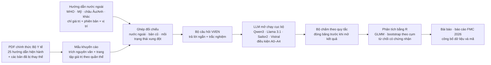

# Chuẩn điều trị của ai?

**Đo sai lệch của mô hình ngôn ngữ lớn (LLM) so với hướng dẫn chẩn đoán và điều trị hiện hành của Bộ Y tế Việt Nam, và truy nguồn từng lỗi: theo một hướng dẫn nước ngoài có tên, theo phiên bản Bộ Y tế cũ, hay không khớp nguồn nào đã ghi nhận.**

[](https://github.com/bminhnemhoi/HoiNghiFMC2026_PhanChauTrinhUni/actions/workflows/tests.yml)


🇬🇧 [English version](README.md)

---

## Vì sao làm đề tài này

Sinh viên và nhân viên y tế ngày càng hỏi LLM về liều thuốc, ngưỡng chẩn đoán, thuốc đầu tay. Ở Việt Nam, chuẩn chuyên môn là **hướng dẫn chẩn đoán và điều trị hiện hành của Bộ Y tế**. LLM học chủ yếu từ tài liệu nước ngoài nên có thể trả lời theo giá trị của WHO, Mỹ, châu Âu, hoặc theo một bản Bộ Y tế đã bị thay thế. Sai kiểu này khó nhận ra vì con số đó có thật ở một hướng dẫn khác.

Đề tài xây một **phương pháp kiểm định tái lập được**:

1. trích mọi khuyến cáo có giá trị cụ thể từ PDF chính thức của Bộ Y tế (trích nguyên văn, kèm số trang);
2. gắn **giá trị đối chiếu**: giá trị hướng dẫn nước ngoài có tên và phiên bản, giá trị bản Bộ Y tế cũ, và **giá trị mồi** đặt trước (giá trị sai dùng để ước tính mức trùng ngẫu nhiên);
3. hỏi các LLM mã nguồn mở chạy cục bộ bằng tiếng Việt và tiếng Anh, ở các điều kiện được kiểm soát;
4. chấm bằng **quy tắc so giá trị đăng ký trước**, phân loại từng câu sai theo nguồn;
5. kiểm định xem mức trùng chuẩn nước ngoài có vượt mức trùng ngẫu nhiên không, và đưa văn bản Bộ Y tế cho mô hình có sửa được lỗi không.

Đề tài cũng nghiên cứu **từ chối có chứng nhận**: tín hiệu bất đồng không cần nhãn có khoanh được câu trả lời rủi ro cao, kèm bảo đảm thống kê về sai số, hay không.

> Đây là nghiên cứu đo lường. Đề tài không xây công cụ kê đơn và không đánh giá hướng dẫn nào "đúng hơn": hành vi mong muốn là trung thành với chuẩn Việt Nam hiện hành, tốt nhất là biết chỗ khác chuẩn nước ngoài. **Không dùng nội dung repo này để ra quyết định lâm sàng.**

## Câu hỏi nghiên cứu (đăng ký trước)

| | Câu hỏi | Giả thuyết xác nhận |
|---|---|---|
| **RQ1** Đo lường và truy nguồn | Khi được hỏi rõ "theo Bộ Y tế", bao nhiêu khuyến cáo xung đột bị trả lời bằng giá trị nước ngoài hoặc bản cũ? | **H1 (chính):** hỏi tiếng Việt, nêu Bộ Y tế: tỉ lệ trùng giá trị nước ngoài cao hơn tỉ lệ trùng mồi. **H2:** hỏi tiếng Anh làm tăng trùng chuẩn Mỹ. |
| **RQ2** Cơ chế | Có ngữ cảnh (truy xuất, đúng đoạn, cả chương) thì sai lệch còn bao nhiêu? | **H3:** kể cả khi đưa đúng đoạn, trả lời theo nước ngoài hoặc bản cũ vẫn > 5% ở ít nhất một nửa số mô hình mở. |
| **RQ3** Kiểm soát | Tín hiệu bất đồng không cần nhãn có tách được câu rủi ro cao, chứng nhận được sai số ở mức trả lời cố định không? | **H4:** nhóm bất đồng có rủi ro ít nhất gấp đôi nhóm đồng thuận. |

Điều kiện hỏi: **A0** không nêu quốc gia · **A1** "theo hướng dẫn hiện hành của Bộ Y tế" (điều kiện chính) · **A2** RAG trên kho Bộ Y tế · **A3** đưa đúng đoạn hướng dẫn · **A4** đưa cả chương. Nhãn trả lời theo thứ tự ưu tiên: đúng và biết bối cảnh → đúng theo Bộ Y tế → lệch phiên bản → trùng chuẩn nước ngoài → không quy được nguồn → không đưa giá trị.

## Quy trình



Mọi con số trong abstract và bài báo do mã phân tích ghi vào kho số liệu (`results/numbers.json`) rồi chèn vào văn bản dạng `{{khóa}}`; công cụ kiểm tra từ chối số gõ tay.

## Kết quả thí điểm (đã xong, 9/2026)

Thí điểm trên **61 khuyến cáo chọn chủ đích** (trong 65) thuộc **12 văn bản Bộ Y tế còn hiệu lực**; một mô hình mở nhỏ (**Qwen3-8B**, lượng tử hóa 4-bit, chạy trên laptop); trả lời ngắn bằng tiếng Việt và tiếng Anh ở A0, A1, A3. Bộ chấm 1.2.0 được đóng băng trước khi mở niêm phong đầu ra mô hình.

| Điều kiện (nhóm xung đột, n = 20) | Đúng | Ghi chú |
|---|---|---|
| Tiếng Việt, không nêu quốc gia (A0) | 2/20 | |
| Tiếng Việt, nêu Bộ Y tế (A1) | **7/20** (35,0%; KTC 95% 15,4%–59,2%) | 2 trùng giá trị nước ngoài, 7 không khớp nguồn đã ghi nhận, 4 câu bộ chấm không đọc được; phân tích độ nhạy theo nhãn AI phân xử: 8/20 |
| Tiếng Việt, kèm đúng đoạn (A3) | 13/20 | so với A1: 9 sai thành đúng, 3 đúng thành sai (McNemar, khám phá: p = 0,15) |
| Tiếng Anh, A0 / A1 / A3 | 3/20 · 5/20 · 13/20 | A1 so với A3, McNemar khám phá: p = 0,02 |

- Trùng nước ngoài so với trùng mồi (15 khuyến cáo xung đột có mồi, tiếng Việt, A1): **2 và 0** → chưa cho thấy xu hướng theo chuẩn nước ngoài vượt mức ngẫu nhiên.
- Nhóm đối chứng (giá trị Bộ Y tế trùng nước ngoài): nêu Bộ Y tế đúng 9/21; kèm đúng đoạn đúng 19/21.
- Bộ chấm quy tắc so với nhãn AI phân xử (trả lời ngắn): khớp 89,5% (KTC 95% 86,0%–92,3%), κ = 0,83.

**Diễn giải:** với mô hình nhỏ này, phần lớn câu sai không khớp nguồn đã ghi nhận; đưa văn bản Bộ Y tế giúp đúng nhiều hơn nhưng vẫn còn sai. Hạn chế: mẫu chọn tay, một mô hình, **mọi kiểm tra do AI (Claude) thực hiện, chưa có bác sĩ duyệt**. Chi tiết: [`results/pilot/pilot_summary.md`](results/pilot/pilot_summary.md); abstract hội nghị: [`Nop_Final_PhanChauTrinh_HT2026/`](Nop_Final_PhanChauTrinh_HT2026/).

## Tiến độ hiện tại

| Hạng mục | Trạng thái |
|---|---|
| Thí điểm + abstract FMC 2026 (VI/EN, đúng mẫu hội nghị) | ✅ xong; tác giả nộp (hạn 30/9/2026) |
| Kho 25 hướng dẫn Bộ Y tế hiện hành + chuỗi thay thế | ✅ xong ([`review/supersession_check.md`](review/supersession_check.md)) |
| Bản đăng ký trước (OSF) | ✅ bản nháp ([`prereg/`](prereg/)); tác giả nộp (hạn 7/10/2026) |
| Trích mẩu nghiên cứu chính | 🟡 45/62 phần trang, 10.903 mẩu thô; chờ kiểm toán độc lập |
| Kho giá trị nước ngoài có phiên bản | 🟡 10/12 nhóm bệnh, 1.464 bản ghi; chờ kiểm |
| Máy chủ mô hình cục bộ (4 mô hình mở) và môi trường R | ✅ sẵn sàng |
| Bản thảo (khung JMIR / TRIPOD-LLM) | 🟡 đã viết Phương pháp, Hạn chế; phần Kết quả chờ nghiên cứu chính |

Bộ theo dõi việc: 32/98 việc xong, 6 việc bỏ theo quyết định của tác giả (`scripts/vs list`). Bàn giao chi tiết: [`docs/HANDOFF.md`](docs/HANDOFF.md).

## Lộ trình

| Thời gian (2026–27) | Mốc |
|---|---|
| 30/9 | Nộp abstract FMC 2026 (Trường Đại học Phan Châu Trinh) |
| trước 7/10 | Đăng ký trước kế hoạch phân tích trên OSF |
| tháng 10 | Trích nốt mẩu + kiểm toán AI độc lập; hoàn tất kho nước ngoài; ghép đối chiếu và mồi |
| 15/10 | Đóng băng kho hướng dẫn |
| cuối 10 – đầu 11 | Đóng băng mẩu v1; kiểm bộ chấm trên tập giữ riêng; dựng và đóng băng bộ câu hỏi VI/EN |
| 11 – đầu 12 | Chạy 4 mô hình mở cục bộ × các điều kiện; kiểm chất lượng lượt chạy |
| tháng 12 | Chấm; phân tích xác nhận bằng R (GLMM, bootstrap theo cụm), từ chối có chứng nhận; hình |
| 12/12 | Báo cáo tại FMC 2026 (nếu được nhận) |
| 11–24/1/2027 | Nộp *JMIR Medical Informatics* / *IJMI*; công bố dữ liệu và mã |

Cổng chất lượng: hội đồng phản biện AI ở mỗi mốc (M1–M4), kiểm toán toàn vẹn độc lập trước mỗi lần nộp, kiểm kho số liệu (`make verify`).

## Cấu trúc repo

```text
configs/        hằng số đăng ký trước, mô hình, điều kiện, quy tắc chấm, giao thức trích mẩu
src/vnsoc/      gói Python: trích mẩu, kiểm nguyên văn, ghép đối chiếu, chấm, chạy mô hình, phân tích, dựng abstract FMC
analysis_R/     thống kê xác nhận (GLMM) bằng R
scripts/        máy trạng thái việc (vs), công cụ dựng gói nộp, workflow agent chạy tiếp được (scripts/workflows/)
data/interim/   danh mục văn bản, mẩu khuyến cáo (trích nguyên văn), giá trị nước ngoài (chỉ giá trị + vị trí)
results/        bảng, hình, numbers.json (nguồn duy nhất của mọi con số báo cáo)
manuscript/     khung bài báo, nguồn abstract FMC, tài liệu tham khảo
prereg/         đăng ký trước OSF, kế hoạch phân tích, addendum
review/         báo cáo kiểm toán, hội đồng phản biện, kiểm tra chuỗi thay thế
docs/           đề cương, kế hoạch, sổ quyết định, bàn giao
state/          theo dõi việc và các cổng chỉ tác giả làm (HG*)
.claude/        định nghĩa agent, skill, hook dùng cho phần việc có AI hỗ trợ
Nop_Final_PhanChauTrinh_HT2026/   gói nộp hội nghị
```

## Bắt đầu

Cần: Python ≥ 3.10, Git; tùy chọn: R ≥ 4.3 (phân tích), [Ollama](https://ollama.com) (mô hình cục bộ), Microsoft Word (xuất PDF gói nộp FMC), Tesseract (OCR).

```bash
git clone https://github.com/bminhnemhoi/HoiNghiFMC2026_PhanChauTrinhUni.git
cd HoiNghiFMC2026_PhanChauTrinhUni
python -m venv .venv && .venv/bin/python -m pip install -e ".[dev]"   # Windows: .venv\Scripts\python
export PYTHONUTF8=1

.venv/bin/python -m pytest -m "not raw_data"      # các test không cần PDF gốc
.venv/bin/python -m vnsoc.numbers verify          # mọi con số báo cáo đều lấy từ kho số liệu
scripts/vs list                                   # theo dõi việc
```

PDF chính thức của Bộ Y tế **không được phát hành lại** trong repo. `data/interim/manifest.jsonl` ghi URL chính thức và mã SHA-256 của từng văn bản; tải về `data/raw/` bằng `python -m vnsoc.extract.fetch_pdf --key <văn bản> --url <URL chính thức>` (ghi nguyên tử, kiểm mã băm) để chạy đủ bộ test và kiểm nguyên văn.

Làm việc trong Claude Code: `/next` (việc kế tiếp), `/status`, `/gate` (ghi nhận cổng của tác giả), `/pause`, `/resume`, `/review-panel Mx`, `/verify`. Trạng thái việc chỉ đổi qua `scripts/vs`. Việc của tác giả: [`state/HUMAN_TODO.md`](state/HUMAN_TODO.md); nhật ký: [`docs/LOG.md`](docs/LOG.md).

## Nguyên tắc toàn vẹn

- **Không bịa giá trị**: mọi giá trị Bộ Y tế có trích nguyên văn và số trang, được mã kiểm lại trên PDF.
- **Đăng ký trước và đóng băng**: kho văn bản, mẩu, câu hỏi, quy tắc chấm được đóng băng (kèm SHA-256) trước khi chạy chính; mọi thay đổi ghi ở [`docs/DECISIONS.md`](docs/DECISIONS.md) kèm addendum.
- **Kho số liệu**: không có số gõ tay trong abstract hay bài báo.
- **Ghi đúng bản chất**: kiểm tra thí điểm do AI thực hiện (hai lượt mù + AI phân xử), không phải người hay bác sĩ; phân tích khám phá được ghi rõ; kết quả âm tính vẫn báo cáo.
- **Bản quyền và pháp lý**: văn bản Bộ Y tế chỉ lấy từ nguồn chính thức, không phát hành lại toàn văn; hướng dẫn nước ngoài chỉ lưu *giá trị + trích dẫn + vị trí*, không lưu đoạn văn.
- **Chi phí**: chạy trên laptop với mô hình mở cục bộ; không dùng API trả phí.

## Nhóm tác giả

- **Ngô Bình Minh**: Khoa Công nghệ thông tin, Trường Đại học Tôn Đức Thắng, TP. Hồ Chí Minh. Tác giả liên hệ: ngobinhminh.st@tdtu.edu.vn
- **Ngô Bình Thống**: Khoa Y, Trường Đại học Phan Châu Trinh, TP. Đà Nẵng
- **Trần Đoàn Mai Hương**: Khoa Răng Hàm Mặt, Trường Đại học Phan Châu Trinh, TP. Đà Nẵng

Một phần công việc kỹ thuật, trích xuất và kiểm toán được thực hiện với sự hỗ trợ của AI (Claude, Anthropic); định nghĩa agent nằm trong `.claude/`, và mọi kiểm tra do AI thực hiện đều được ghi rõ là như vậy.

## Trích dẫn và giấy phép

Nếu nhắc tới công trình trước khi công bố, hãy trích dẫn repo (xem [`CITATION.cff`](CITATION.cff)). Chưa chọn giấy phép; trong thời gian đó mọi quyền thuộc về nhóm tác giả. Liên hệ tác giả liên hệ nếu muốn sử dụng lại.
