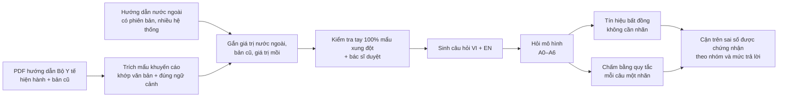

# Đề cương nghiên cứu (v3, bản chốt 25/9/2026)

Tác giả: Bình Minh (sinh viên CNTT, TDTU) · Chốt ngày 25/9/2026 sau hai vòng phản biện · Đi kèm: `02_KE_HOACH_TRIEN_KHAI.md`, `03_PROMPT_CLAUDE_CODE.md`

|  |  |
| --- | --- |
| **Đề tài** | *Chuẩn điều trị của ai?* Sai lệch theo chuẩn nước ngoài và theo phiên bản cũ của LLM so với hướng dẫn chuyên môn của Bộ Y tế Việt Nam |
| **Vấn đề** | Ngay cả khi được yêu cầu “theo Bộ Y tế”, LLM có thể trả lời bằng giá trị của hướng dẫn nước ngoài hoặc của bản đã bị thay thế. Ví dụ: chỉ định điều trị viêm gan B theo QĐ 1740/2026 (ALT trên giới hạn 30/19 U/L) khác AASLD 2025 (ALT ≥ 2× giới hạn 35/25) và khác bản 2019; sốt rét P. falciparum 3 tháng đầu thai kỳ dùng quinin + clindamycin (QĐ 3377/2023) thay vì artemether–lumefantrin (CDC) |
| **Đóng góp chính** | Quy từng câu trả lời sai về **một nguồn có tên** (hướng dẫn nước ngoài cụ thể, hoặc bản Bộ Y tế cũ cụ thể) bằng đối chiếu giá trị, có đối chứng trùng ngẫu nhiên, cho hàng nghìn khuyến cáo (liều, ngưỡng, thuốc, lịch), bằng tiếng Việt và tiếng Anh, qua các mức ngữ cảnh |
| **Đóng góp phụ** | Lớp từ chối trả lời có chứng nhận thống kê, nhóm theo tín hiệu xung đột, kiểm tra trên hướng dẫn chưa từng thấy |
| **Vì sao chọn** | Vòng 1: 7,26/10, đứng đầu 11 ứng viên (đề tài ECG cũ thứ 8). Vòng 2: không ai bác bỏ; bốn người yêu cầu sửa lớn, người thứ năm đồng ý làm nếu thu hẹp phạm vi; bản này đã sửa theo 19 nhóm yêu cầu (mục 8) |
| **Dữ liệu** | 25–35 hướng dẫn Bộ Y tế có PDF chính thức + bản cũ + hướng dẫn nước ngoài có ngày; bộ xung đột hạt giống đã được thành viên hội đồng (agent) vai bác sĩ rà lại |
| **Tài nguyên** | Laptop + 50–80 giờ GPU Kaggle (tuần 6–8, dự phòng tuần 9) + ≤ 40 USD API (giá kiểm tra ngày 25/9/2026) |
| **Tạp chí** | JMIR Medical Informatics, IJMI (Q1); JAMIA nếu có bác sĩ đồng tác giả |
| **Tuần này** | Thí điểm khoảng 60 mẩu (mục 5.7); điền abstract (mục 7.3); hỏi ban tổ chức về giới hạn 500; nộp FMC trước 30/9 |


> **Vai trò của file này.** Đây là nguồn sự thật về *nội dung khoa học* (câu hỏi, giả thuyết, dữ liệu, phương pháp, thống kê). Kế hoạch (file 02) và prompt (file 03) tham chiếu theo số mục (§). Với Claude Code, file này là đầu vào chỉ đọc; mọi thay đổi phạm vi phải ghi `docs/DECISIONS.md` và hỏi người dùng. Các số liệu dẫn từ bài báo khác được lấy qua công cụ đọc web và phải đối chiếu lại bản gốc trước khi nộp (§2).

## 1. Đề tài: vấn đề, khoảng trống, câu hỏi nghiên cứu

**Tên tiếng Việt (131 ký tự):** Chuẩn điều trị của ai? Sai lệch theo chuẩn nước ngoài và theo phiên bản cũ của LLM so với hướng dẫn chuyên môn của Bộ Y tế Việt Nam

**Tên tiếng Anh:** Whose Standard of Care? Jurisdictional Defaults, Guideline Staleness and Certified Abstention of LLMs on Vietnamese Ministry of Health Guidelines

**Đóng góp trong một câu:** một nghiên cứu đánh giá *có truy nguồn* — đo sai lệch của LLM so với hướng dẫn Bộ Y tế và truy mỗi lỗi tới một hướng dẫn nước ngoài hoặc một phiên bản cũ có tên; lớp từ chối trả lời có chứng nhận là mục tiêu phụ.

### 1.1 Vì sao đây là vấn đề lớn

- **LLM đã vào giảng đường.** Khảo sát 1.002 sinh viên ĐH Y Dược Thái Bình (JMIR Formative Research 2026): 79,6% quen thuộc với ChatGPT, Gemini hoặc Bing; cách dùng phổ biến nhất là tra cứu và tóm tắt tài liệu.
- **Năng lực hành nghề sắp được kiểm tra bắt buộc.** Theo Luật Khám bệnh, chữa bệnh 15/2023/QH15, bác sĩ phải qua kỳ kiểm tra đánh giá năng lực hành nghề từ 1/1/2027; đã thi thí điểm tháng 8/2026 với 3.228 thí sinh từ 29 cơ sở. Nghiên cứu này **không** khẳng định đề thi dựa trên hướng dẫn nào; bối cảnh này chỉ cho thấy sinh viên đang cần nguồn tra cứu đáng tin theo chuẩn Việt Nam.
- **LLM dùng một “chuẩn mặc định”.** Với câu hỏi hành chính–pháp lý (có cả y tế) không nêu quốc gia, 74,5% câu trả lời cho câu hỏi tiếng Anh theo khung của Mỹ (Wang & Suresh, arXiv 2606.00333). Trong 30 tình huống thần kinh–chẩn đoán hình ảnh, GPT-o3, Mistral Large và DeepSeek-R1 chọn chuẩn Mỹ 27/30 khi không nêu hướng dẫn; khi được yêu cầu theo hướng dẫn ngoài Mỹ chỉ đúng 9–11/30; tìm kiếm web cải thiện một phần; đưa toàn văn hướng dẫn gần như khôi phục độ chính xác (86,7–95% chung, 80–90% với mục ngoài Mỹ) (Bazerbachi et al., Eur Radiol 2026).
- **LLM giữ kiến thức cũ.** Độ chính xác với kiến thức y khoa mới giảm dần theo thời gian chứ không rơi đột ngột ở ngày cắt dữ liệu (TempoMed-Bench, arXiv 2605.13045); các mô hình đều dựa vào khuyến cáo đã lỗi thời (DriftMedQA; Facts Fade Fast, Findings EMNLP 2025).
- **Việt Nam khác nước ngoài ở những điểm cụ thể, kiểm chứng được** (đã được thành viên hội đồng (agent) vai bác sĩ đối chiếu văn bản, mục 3.3): sốc dengue ở người lớn truyền 15 ml/kg/giờ (QĐ 2760/QĐ-BYT) so với 5–10 ml/kg/giờ (WHO 2009; cần đối chiếu thêm hướng dẫn WHO 2025); mục tiêu huyết áp ở người đái tháo đường không có biến chứng thận hay nguy cơ cao < 140/90 (QĐ 5481/QĐ-BYT) so với < 130/80 (ADA 2025); sốt rét 3 tháng đầu thai kỳ dùng quinin + clindamycin (QĐ 3377/QĐ-BYT) so với artemether–lumefantrin (CDC); chỉ định điều trị viêm gan B (QĐ 1740/QĐ-BYT 2026) so với AASLD 2025.
- **Hướng dẫn thay đổi nhanh.** Riêng 2025–2026, Bộ Y tế đã thay hướng dẫn viêm gan B (QĐ 1740, 16/6/2026 thay QĐ 3310/2019), COPD (QĐ 2131, 14/7/2026), viêm phổi cộng đồng (QĐ 2147, 15/7/2026), cúm mùa và sởi (2025).

Nguy cơ thật là LLM trả lời *đúng ở nơi khác hoặc đúng với bản cũ*, nghe rất có cơ sở nên người hỏi khó phát hiện. Những benchmark dịch từ tiếng Anh có thể mã hóa luôn đáp án theo chuẩn Mỹ: HealthBench dịch sang tiếng Nhật có nhiều tiêu chí chấm mâu thuẫn với hướng dẫn Nhật (Hisada et al., arXiv 2509.17444).

### 1.2 Chuẩn tham chiếu và cách phân loại câu trả lời

**Chuẩn tham chiếu** là văn bản hướng dẫn chuyên môn do Bộ Y tế ban hành và đang có hiệu lực tại ngày đóng băng kho dữ liệu. Mục tiêu đo là mức *trung thành với hướng dẫn Việt Nam*, không phải mức “đúng về y khoa”. Một số giá trị của Bộ Y tế có thể chậm hơn bằng chứng hiện nay; những mục này được bác sĩ đánh dấu và kết quả được báo cáo có và không có chúng.

**Đáp án là một tập giá trị**, không phải một con số: một khoảng (“0,5–1 mg”), một tập thuốc, hoặc nhiều giá trị cùng hợp lệ trong các văn bản Bộ Y tế hiện hành cho đúng quần thể. Một mẩu chỉ được coi là **có xung đột** khi giá trị nước ngoài nằm **ngoài** tập giá trị của Việt Nam.

**Mỗi câu trả lời nhận đúng một nhãn**, xét theo thứ tự ưu tiên cố định trước:

| Thứ tự | Nhãn | Điều kiện |
| --- | --- | --- |
| 1 | Đúng và biết bối cảnh | Nêu giá trị Bộ Y tế và chỉ rõ chỗ khác chuẩn nước ngoài, hoặc hỏi lại quốc gia — đây là hành vi mong muốn |
| 2 | Đúng theo Bộ Y tế | Giá trị nằm trong tập giá trị Bộ Y tế hiện hành |
| 3 | Lệch phiên bản | Khớp giá trị của một bản Bộ Y tế đã bị thay thế |
| 4 | Lỗi trùng chuẩn nước ngoài | Khớp giá trị của ít nhất một hướng dẫn nước ngoài có tên; ghi rõ hệ thống: Mỹ, châu Âu/Anh, WHO toàn cầu, WHO khu vực Tây Thái Bình Dương |
| 5 | Không quy được nguồn | Sai nhưng không khớp nguồn nào đã biết |
| 6 | Từ chối | Không đưa giá trị |

Hai quy tắc đi kèm:

- **Mẩu không phân biệt được nguồn** (ví dụ giá trị nước ngoài trùng giá trị bản cũ, hay khoảng dung sai chồng lấn) được tách riêng và không dùng cho kiểm định xác nhận.
- **Đối chứng trùng ngẫu nhiên:** mỗi mẩu có một *giá trị mồi* cùng loại, cùng đơn vị, hợp lý như nhau và cách giá trị Việt Nam tương đương. Số liệu chính là phần *vượt* mức trùng ngẫu nhiên: (π\_nước ngoài − π\_mồi) / (1 − π\_mồi). Với trắc nghiệm, đáp án nhiễu đóng vai trò mồi.

**Khi các văn bản Bộ Y tế khác nhau** (ví dụ mục tiêu huyết áp trong QĐ 3192/2010, 5904/2019 và 5481/2020): mọi giá trị đang có hiệu lực cho đúng quần thể đều được tính là đúng. Thứ tự ưu tiên khi cần chọn một giá trị hiển thị: (1) văn bản chuyên đề cho đúng quần thể, (2) văn bản mới nhất. Số mục mâu thuẫn nội bộ được báo cáo như một kết quả phụ, không bị loại âm thầm.

### 1.3 Khoảng trống

Chi tiết ở mục 2. Đã có người chỉ ra ba hiện tượng riêng lẻ: LLM dùng chuẩn mặc định theo ngôn ngữ (Wang & Suresh, câu hỏi hành chính–pháp lý), ngả về chuẩn Mỹ (Bazerbachi, 30 tình huống), và giữ kiến thức cũ (DriftMedQA, TempoMed-Bench, Facts Fade Fast). Chưa ai làm:

1. Truy nguồn **ở mức giá trị** tới một hướng dẫn nước ngoài hoặc bản cũ có tên, có đối chứng trùng ngẫu nhiên, cho hàng nghìn khuyến cáo lâm sàng.
2. Làm điều đó cho một chuẩn quốc gia Đông Nam Á, bằng tiếng bản địa và tiếng Anh.
3. Tách nguồn lỗi qua các mức ngữ cảnh: truy xuất sai hay có đúng đoạn mà mô hình vẫn giữ giá trị của nó.
4. Kiểm tra xem tín hiệu xung đột không cần nhãn có đủ tốt để chia nhóm chứng nhận từ chối hay không, trên cả hướng dẫn mô hình chưa thấy.

### 1.4 Câu hỏi nghiên cứu và giả thuyết

Chỉ H1 là giả thuyết xác nhận chính; H2–H4 là giả thuyết xác nhận phụ (hiệu chỉnh Holm trong họ {H2, H3, H4}); còn lại là mô tả. Điều kiện xác nhận của H1–H2 là **A1** (câu hỏi nói rõ “theo hướng dẫn của Bộ Y tế”), vì khi câu hỏi không nêu quốc gia (A0), trả lời theo chuẩn Mỹ không hẳn là sai.

|  | Câu hỏi | Giả thuyết / cách báo cáo (đăng ký trước) |
| --- | --- | --- |
| RQ1 – Đo lường và truy nguồn | Khi được yêu cầu rõ “theo Bộ Y tế”, bao nhiêu phần trăm mẩu xung đột bị trả lời bằng giá trị nước ngoài hoặc bản cũ? | **H1 (chính):** ở A1 tiếng Việt, tỉ lệ trả lời trùng giá trị nước ngoài trên mẩu xung đột cao hơn tỉ lệ trùng giá trị mồi (cận dưới khoảng tin cậy (KTC) 95% của hiệu > 0), cho tập mô hình mở gộp. **H2 (lặp lại Wang & Suresh ở mức giá trị):** ở A1, hỏi bằng tiếng Anh cho tỉ lệ trùng chuẩn Mỹ cao hơn hỏi bằng tiếng Việt, trên các mẩu mà giá trị Mỹ khác mọi nguồn khác. **Mô tả:** A0 (chuẩn mặc định), lệch phiên bản theo số tháng từ ngày ban hành đến ngày cắt dữ liệu, kiểm tra thiên lệch “mới nhất” |
| RQ2 – Cơ chế | Có ngữ cảnh (truy xuất, đưa đúng đoạn, đưa toàn chương) thì sai lệch còn bao nhiêu, do đâu? | **H3:** ở A3 (đưa đúng đoạn), tỉ lệ trả lời trùng nước ngoài hoặc bản cũ trên mẩu xung đột vẫn > 5% (cận dưới KTC 95% > 5%) ở ít nhất một nửa số mô hình mở |
| RQ3 – Kiểm soát (phụ) | Tín hiệu xung đột không cần nhãn có tách được câu rủi ro cao, và chứng nhận được sai số ở mức trả lời nào? | **H4:** nhóm có bất đồng có rủi ro ít nhất gấp đôi nhóm đồng thuận khi trả lời tất cả (cận dưới KTC theo cụm của tỉ số > 2). **Mô tả:** cận trên sai số được chứng nhận ở các mức trả lời cố định; so với chia nhóm theo chuyên khoa; tần suất vi phạm trên hướng dẫn chưa thấy |
| RQ4 – Giáo dục y khoa | Sai lệch phân bố thế nào trên khung 128 vấn đề? Câu tình huống đặt ở bệnh viện Việt Nam (không nói “theo Bộ Y tế”) có cho kết quả giống A1 không? | Mô tả (bài thứ hai nếu thiếu thời gian) |

### 1.5 Nghiên cứu này không làm gì

- Không xây công cụ kê đơn hay hỗ trợ quyết định để dùng trên bệnh nhân.
- Không tuyên bố gì về nội dung đề thi quốc gia; khung 128 vấn đề chỉ dùng để ánh xạ phạm vi.
- Không đánh giá hướng dẫn nào đúng hơn. Hành vi mong muốn là câu trả lời *biết bối cảnh quốc gia* (nhãn 1 ở bảng trên), và hành vi này được đo trực tiếp.
- Không tuyên bố phương pháp áp dụng được cho nước khác khi chưa thử; chỉ nêu đó là hướng mở rộng.

## 2. Tổng quan tài liệu và điểm mới

Các bài dưới đây đã được agent mở và đọc (tóm tắt hoặc toàn văn). Vòng phản biện 2 bổ sung 15 bài mới (chủ yếu 3–9/2026) và sửa ba mô tả sai. Số liệu lấy qua công cụ đọc web cần đối chiếu lại bài gốc trước khi nộp. Phần tìm kiếm trên PubMed và tạp chí y học Việt Nam chưa làm được (bị chặn); sinh viên cần tự tra trước khi nộp, ví dụ trên tapchiyhocvietnam.vn với từ khóa “ChatGPT” + “phác đồ” hoặc “Bộ Y tế”.

### 2.1 Những công trình gần nhất

| Công trình | Đã làm | Chưa làm (so với đề tài này) |
| --- | --- | --- |
| **Wang & Suresh 2026**, *Auditing Jurisdictional Defaults in Multilingual LLMs* (arXiv 2606.00333) | 7 LLM, 2.520 câu trả lời cho câu hỏi hành chính–pháp lý không nêu quốc gia; tiếng Anh → 74,5% theo khung Mỹ, tiếng Trung → 53,3% theo khung Trung Quốc | Không phải giá trị lâm sàng; không truy tới hướng dẫn có tên; không có ngữ cảnh hay biện pháp. H2 của đề tài là lặp lại ở mức giá trị |
| **Bazerbachi et al.**, *Cultural bias in LLMs' ability to follow neuroradiology guidelines*, Eur Radiol 2026;36:7444–7453 | 30 tình huống, tiếng Anh và Pháp, có và không nêu hướng dẫn; biện pháp giảm: tìm kiếm web và đưa PDF hướng dẫn; 3 mô hình lớn + MedGemma 1.5 4B | Chỉ 30 mục, một chuyên khoa, bác sĩ chấm; không có châu Á; không xét phiên bản; không có nhánh “đưa đúng đoạn” |
| **CPGBench** (Tan et al., arXiv 2603.25196) | 3.418 hướng dẫn, 9 quốc gia/vùng lãnh thổ + WHO, ESNM; 32.155 khuyến cáo; tuân thủ 21,8–63,2%; chấm bằng GPT-4o; có ghi năm và quốc gia của từng khuyến cáo | Không có Đông Nam Á; không phân tích xung đột giữa quốc gia hay chuỗi thay thế phiên bản; không có RAG; không có biện pháp |
| **TempoMed-Bench** (Guan et al., arXiv 2605.13045) | Độ chính xác với kiến thức mới giảm tuyến tính theo thời gian; với kiến thức cũ chỉ 25–54% | Không xét quốc gia; H5 cũ (bước nhảy ở ngày cắt dữ liệu) mâu thuẫn với kết quả này nên đã đổi thành biến liên tục |
| **DriftMedQA** (Wu et al., arXiv 2505.07968); **Facts Fade Fast** (Vladika et al., Findings EMNLP 2025, arXiv 2509.04304) | Khuyến cáo mới–cũ (HIV, đái tháo đường; MedRevQA 16,5 nghìn câu); mô hình dựa vào kiến thức lỗi thời | Tiếng Anh, không xét quốc gia, không bảo đảm |
| **Prior, Schultz & Grabmair 2026**, *Asking For An Old Friend* (arXiv 2605.23497) | Luật Đức: mô hình dùng văn bản hết hiệu lực và có **thiên lệch “mới nhất”**; so sánh RAG có ràng buộc hiệu lực thời gian | Tương tự trục phiên bản nhưng trong pháp luật; đề tài thêm kiểm tra thiên lệch “mới nhất” |
| **Alama Health QA** và **Mind the Gap** (Mutisya et al., arXiv 2507.14615, 2507.16322) | Câu hỏi từ hướng dẫn Kenya, tiếng Anh và Swahili, bác sĩ cùng xây dựng; benchmark phương Tây bỏ sót bệnh châu Phi | Không truy lỗi về nguồn nước ngoài hay bản cũ; phụ thuộc bác sĩ |
| **Bui et al. 2026**, *Perspectives on Cross-Lingual Consistency in LLMs for Medical Questions* (EMNLP 2026, arXiv 2609.07687) | Hỏi chuyên gia: khác biệt giữa ngôn ngữ là lỗi hay là thích nghi hợp lý; chưa có benchmark tách câu “phổ quát” với câu “phụ thuộc bối cảnh” | Đề tài là một benchmark như vậy cho y khoa Việt Nam |
| **Safety That Does Not Transfer** (Gabriel et al., arXiv 2607.17270) | Tiếng Anh so với Hausa: mô hình nhỏ tụt từ 1,57 xuống −0,03 điểm đúng lâm sàng | Đo lệch theo ngôn ngữ, không theo chuẩn quốc gia |
| **HealthBench cho Nhật** (Hisada et al., arXiv 2509.17444); **Kasai et al. 2023** (arXiv 2303.18027) | Tiêu chí chấm dịch từ Mỹ mâu thuẫn hướng dẫn Nhật; GPT-4 chọn lựa chọn bị cấm tại Nhật | Bằng chứng rằng benchmark mã hóa chuẩn Mỹ; không đo có hệ thống |
| **CLEAR** (Wang et al., arXiv 2609.16301) | Phân xử giữa trí nhớ mô hình và kho tài liệu, tiếng Anh | Không có trục quốc gia; luôn trả lời |
| **VM14K**, **ViMedAQA**, **ViHERMES** (arXiv 2506.01305; ACL SRW 2024; arXiv 2602.07361) | Câu hỏi y khoa tiếng Việt; ViHERMES là hỏi đáp văn bản pháp quy y tế | Không dựa trên hướng dẫn điều trị; ViHERMES là nhóm trong nước gần nhất có thể mở rộng sang hướng dẫn |

### 2.2 Xung đột giữa ngữ cảnh và trí nhớ của mô hình

- **ClashEval** (arXiv 2404.10198): mô hình chấp nhận ngữ cảnh sai hơn 60% số lần, càng tin vào trí nhớ càng ít nghe ngữ cảnh.
- **Adaptive Chameleon or Stubborn Sloth** (ICLR 2024): dễ nghe bằng chứng mạch lạc nhưng thiên về trí nhớ khi bằng chứng lẫn lộn; kho trộn Bộ Y tế và WHO (A5) kiểm tra đúng điều này.
- **Khảo sát xung đột tri thức** (arXiv 2403.08319).
- **Yeginbergen et al. 2026** (arXiv 2604.20531): với ngôn ngữ ít tài nguyên, truy xuất cả tiếng Anh và tiếng bản địa cho kết quả tốt nhất. Điều này tạo ra mâu thuẫn cần kiểm tra: tài liệu tiếng Anh có thể kéo câu trả lời về chuẩn nước ngoài. A5 đo đúng hiệu ứng này.
- **Góc nhìn ngược:** Molfetta et al. 2026 (*Sycophants in the Courtroom*, arXiv 2608.21409) cho rằng “sự thật y khoa không phụ thuộc quốc gia, còn luật thì có”. Đề tài này cho thấy khuyến cáo điều trị cũng phụ thuộc quốc gia.

### 2.3 Bảo đảm thống kê khi mô hình được phép từ chối

| Công trình | Ý chính | Quan hệ với đề tài |
| --- | --- | --- |
| Learn then Test (arXiv 2110.01052); Conformal Risk Control (arXiv 2208.02814) | Chọn ngưỡng bằng kiểm định nhiều giả thuyết; kiểm soát kỳ vọng mất mát đơn điệu | Nền tảng; sai số có chọn lọc không đơn điệu nên dùng Learn-then-Test |
| **Gurram 2026** (arXiv 2608.14639) | Learn-then-Test theo nhóm (Mondrian) với p-value nhị thức chính xác, hiệu chỉnh theo cụm tài liệu; chỉ ra các lỗi rò rỉ khi huấn luyện điểm và lưới ngưỡng sập | Gần như cùng công cụ và cùng cạm bẫy; đề tài áp dụng, không phát minh |
| HG-CRC (Salem et al., arXiv 2607.24562) | Sai số có chọn lọc theo cây nhóm (có cả nhóm theo văn phong); CRC thường vi phạm tới 47% khi nhóm lệch | Không y khoa, không xuyên ngôn ngữ, không xét cụm |
| Conformal abstention (Yadkori et al., arXiv 2405.01563); Conformal Alignment (Gui et al., arXiv 2405.10301); Conformal factuality (arXiv 2402.10978); MedAbstain (arXiv 2601.12471) | Bảo đảm cho việc LLM từ chối hoặc chọn câu đáng tin | Bảo đảm biên hoặc tiếng Anh; không nhóm theo xung đột chuẩn |
| Từ chối xuyên ngôn ngữ (Feng et al., arXiv 2406.15948; MKA, arXiv 2503.23687) | Dùng bất đồng giữa các ngôn ngữ làm tín hiệu từ chối | Tín hiệu VI≠EN không mới; dùng nó để *chia nhóm chứng nhận* thì chưa ai làm |
| Dunn, Wasserman & Ramdas (arXiv 1809.07441) | Tập dự đoán cho mô hình hai tầng (cụm) | Tài liệu đúng cho chế độ “hướng dẫn mới”; với 25–35 hướng dẫn, bảo đảm ở mức cụm không khả thi |

### 2.4 Điểm mới (viết lại sau vòng 2)

**Đóng góp chính, có thể bảo vệ:** theo những gì đã tìm được, đây là nghiên cứu đầu tiên *truy nguồn ở mức giá trị* — tới một hướng dẫn nước ngoài có tên hoặc một bản Bộ Y tế đã bị thay thế có tên, có đối chứng trùng ngẫu nhiên — cho hàng nghìn khuyến cáo liều, ngưỡng, thuốc và lịch của một chuẩn quốc gia Đông Nam Á, bằng tiếng Việt và tiếng Anh, qua các mức ngữ cảnh từ không có gì đến đưa đúng đoạn. Nó mở rộng phát hiện về “chuẩn mặc định” (Wang & Suresh; Bazerbachi) từ câu hỏi hành chính và 30 tình huống sang quy mô khuyến cáo lâm sàng, và gộp trục quốc gia với trục phiên bản (TempoMed, DriftMedQA) trong cùng một khung chấm bằng quy tắc, không dùng LLM chấm.

**Đóng góp phụ, nói đúng mức:** Learn-then-Test theo nhóm với p-value nhị thức chính xác đã có (Gurram 2026; HG-CRC); bất đồng xuyên ngôn ngữ làm tín hiệu từ chối cũng đã có (Feng et al.; MKA). Điểm thêm của đề tài là (1) định nghĩa nhóm chứng nhận từ tín hiệu xung đột chuẩn (không ngữ cảnh ≠ RAG, tiếng Việt ≠ tiếng Anh, đoạn trích dẫn không chứa giá trị trả lời), (2) kiểm tra xem các tín hiệu đó có thật sự tách được câu rủi ro cao không, và (3) đo độ bền trên hướng dẫn mô hình chưa thấy. Đây là xác nhận trong một lĩnh vực mới, không phải phát minh phương pháp.

**Không tuyên bố:** không nói “lần đầu đo lệch theo ngôn ngữ” (Wang & Suresh đã làm); không nói “lần đầu chấm tự động không cần bác sĩ” (CPGBench, DriftMedQA cũng tự động; khác biệt là quy tắc so giá trị thay cho LLM chấm); không nói phương pháp áp dụng được cho nước khác khi chưa thử.

## 3. Dữ liệu

### 3.1 Kho hướng dẫn Bộ Y tế

Đội đã kiểm kê 52 quyết định. Vòng 2 cho thấy việc lấy văn bản khó hơn dự tính: trang kcb.vn/phac-do chỉ liệt kê khoảng 12 mục; một số hướng dẫn mới nằm ở kcb.vn/tai-lieu hoặc kcb.vn/tin-tuc (ví dụ viêm gan B 1740/2026 có PDF ký số); COPD 2131/2026 và viêm phổi 2147/2026 chưa tìm thấy trên kcb.vn; các bản cũ (2010–2019) có thể chỉ là bản quét. Vì vậy:

1. **Phân loại cả 52 quyết định** theo: có PDF chính thức không, có lớp chữ không, là bản quét, hay chỉ thấy trên thuvienphapluat.
2. **Đóng băng kho ở 25–35 hướng dẫn** hiện hành, ưu tiên văn bản có PDF chính thức có lớp chữ; các bản cũ dùng cho phân tích phiên bản không tính vào con số này; tối đa 10 văn bản (hiện hành hoặc cũ) được phép dùng OCR; mọi giá trị lấy từ bản OCR được so tay với ảnh trang gốc.
3. **Ưu tiên hướng dẫn 2025–2026** (cho phân tích phiên bản) và các bệnh giàu xung đột.
4. **Ngày đóng băng kho: 15/10/2026.** Văn bản ban hành sau ngày này không được thêm vào.
5. **Ngân sách thời gian thật: 45–100 giờ** (tìm, tải, lập danh mục, OCR và kiểm số, dựng chuỗi thay thế), không phải một tuần như bản trước.

| Bệnh / chủ đề | Quyết định hiện hành | Thay thế bản | PDF chính thức | Ghi chú |
| --- | --- | --- | --- | --- |
| Sốt xuất huyết Dengue | 2760/QĐ-BYT, 04/07/2023 | 3705/2019 (trước đó 458/2011) | Cần tìm | Người lớn ≥ 16 tuổi tách riêng trẻ em |
| Tay chân miệng | 292/QĐ-BYT, 06/02/2024 | 1003/2012 | Cần tìm | Phân độ riêng của Việt Nam |
| Lao (kể cả lao kháng thuốc) | 162/QĐ-BYT, 19/01/2024 | 1314/2020; cập nhật lao kháng thuốc 2760/2021 | Cần tìm | Bản 2024 đã có phác đồ BPaL(M) |
| Sốt rét | 3377/QĐ-BYT, 30/08/2023 | 2699/2020 (chuỗi 6 phiên bản) | Cần tìm |  |
| Viêm gan B | 1740/QĐ-BYT, 16/06/2026 | 3310/2019 | **Có** (kcb.vn/tai-lieu) | Sau ngày cắt dữ liệu của hầu hết mô hình |
| Viêm gan C | 2855/QĐ-BYT, 25/09/2024 | 2065/2021 | Cần tìm |  |
| HIV/AIDS | 5968/QĐ-BYT, 31/12/2021 | 5456/2019 | Cần tìm |  |
| Viêm phổi cộng đồng người lớn | 2147/QĐ-BYT, 15/07/2026 | 4815/2020 | Chưa thấy trên kcb.vn |  |
| COPD | 2131/QĐ-BYT, 14/07/2026 | 2767/2023 | Bản 2023 **có** (81 trang, có lớp chữ); bản 2026 chưa thấy |  |
| Cúm mùa; Sởi | 1840/2025; 1019/2025 | 2078/2011; 1327/2014 | Cần tìm |  |
| Đái tháo đường típ 2 | 5481/QĐ-BYT, 30/12/2020 | 3319/2017 | Cần tìm | Sửa đổi một phần bởi 1353/2021 |
| Tăng huyết áp | 3192/QĐ-BYT, 31/08/2010 | — | Cần tìm | Khác 5904/2019 và 5481/2020 về mục tiêu |
| Suy tim; Đột quỵ; Bệnh thận mạn | 1857/2022; 3312/2024; 2388/2024 | 1762/2020; 5331/2020; một phần 3931/2015 | Cần tìm |  |
| Tiền sản giật; Béo phì | 1154/2024; 2892/2022 | 1911/2021; — | Cần tìm |  |
| Phản vệ | Thông tư 51/2017/TT-BYT | — | Cần tìm | Là thông tư |
| Truyền nhiễm tổng hợp (thương hàn, sốt mò, nhiễm khuẩn huyết, uốn ván) | 5642/QĐ-BYT, 31/12/2015 | — | Cần tìm | Bệnh phổ biến ở Việt Nam, nên thêm; cộng Whitmore 6101/2019, rắn cắn 3610/2015 |

Ngoài bảng trên, bộ hạt giống còn dùng: QĐ 1622/QĐ-BYT 2014 (dại), Thông tư 10/2024/TT-BYT (lịch tiêm chủng), QĐ 1470/QĐ-BYT 2024 (đái tháo đường thai kỳ), QĐ 678/QĐ-BYT 2025 (dự phòng lây truyền mẹ–con) và QĐ 5904/QĐ-BYT 2019 (bệnh không lây nhiễm tại trạm y tế xã). Số quyết định được đánh lại mỗi năm (2760/QĐ-BYT vừa là lao kháng thuốc 2021 vừa là dengue 2023), nên khóa là (số, năm). Hiệu lực được xác định bằng điều khoản “thay thế” trong chính văn bản, và ghi tới từng mẩu (vì có thay thế một phần, như 2388/2024 chỉ thay vài chương của 3931/2015). Chuỗi thay thế phải kiểm tra lại một lượt độc lập.

### 3.2 Nguồn lấy văn bản và pháp lý

- **Bản quyền hướng dẫn Bộ Y tế.** Luật Sở hữu trí tuệ Điều 15 khoản 2 loại “văn bản hành chính” khỏi đối tượng bảo hộ; hướng dẫn ban hành kèm quyết định của Bộ trưởng nhiều khả năng thuộc diện này. Luật 131/2025/QH15 và Nghị định 134/2026/NĐ-CP thêm ngoại lệ cho nghiên cứu phi thương mại. Đây là diễn giải của đội; cần giảng viên hướng dẫn xác nhận.
- **Không cào thuvienphapluat** (điều khoản cấm công cụ tự động và cấm xây hệ thống tra cứu khác; robots.txt ghi `ai-train=no`). Chỉ dùng để tìm và đối chiếu thủ công.
- **Nguồn chính:** PDF ký số trên kcb.vn (phac-do, tai-lieu, tin-tuc), moh.gov.vn, trang Sở Y tế hoặc bệnh viện đăng lại quyết định. Ghi URL, ngày tải, SHA-256.
- **Hướng dẫn nước ngoài** (ADA, ESC, AHA, GINA, GOLD) có bản quyền; GINA và GOLD yêu cầu đăng ký và cấm phát hành lại. Chỉ công bố giá trị và trích dẫn, không công bố đoạn văn.
- **Phát hành:** mã nguồn, mẩu khuyến cáo (giá trị + trích dẫn), bộ câu hỏi; không phát hành lại toàn văn.

### 3.3 Kho đối chiếu nước ngoài và bộ xung đột hạt giống

**Kho đối chiếu phải có phiên bản và đủ rộng.** Với mỗi mẩu, liệt kê mọi giá trị nước ngoài chính kèm ngày: WHO hiện hành và bản trước, WHO khu vực Tây Thái Bình Dương, Mỹ, châu Âu/Anh. Vì nhiều hướng dẫn Việt Nam dựa trên WHO, WHO không mặc nhiên bị coi là “nước ngoài”; nhãn nguồn ghi rõ từng hệ thống. Ví dụ cần lưu ý: WHO 2009 về dengue đã được thay bằng hướng dẫn bệnh do arbovirus của WHO (4/7/2025); phản vệ cần cả RCUK và WAO/EAACI (0,01 mg/kg, tối đa 0,5 mg). Phần quy nguồn được báo cáo kèm phân tích độ nhạy theo cách chọn kho đối chiếu.

**Bộ hạt giống sau rà soát vòng 2.** Thành viên hội đồng (agent) vai bác sĩ đã đối chiếu 21/25 dòng với văn bản: 13 xác nhận; 5 sai một phần hoặc mô tả chưa đúng (10, 12, 13, 14, 18); 1 nhiều khả năng sai (22); 1 chưa kiểm chứng được phía Việt Nam (21); 1 không phải xung đột mà là thiếu tương ứng (3). Dòng 23–25 do đội nghiên cứu xác minh, chưa được đối chiếu lại ở vòng 2. Bảng dưới đã sửa theo đó. Trước khi dùng cho nghiên cứu chính, mỗi dòng cần: trích nguyên văn hai bên, số trang trong PDF chính thức, quần thể áp dụng, và bác sĩ ký duyệt.

| # | Mục | Việt Nam | Nước ngoài | Trạng thái sau vòng 2 |
| --- | --- | --- | --- | --- |
| 1 | Dengue, sốc ở người lớn: tốc độ dịch đầu | Ringer lactat hoặc NaCl 0,9% 15 ml/kg/giờ, rồi 10 ml/kg/giờ × 2 giờ (2760/2023, mục C.2.1) | 5–10 ml/kg/giờ trong 1 giờ (WHO 2009) | Xác nhận; phải đối chiếu thêm WHO 2025 |
| 2 | Dengue: truyền tiểu cầu | < 5.000/mm³ (cân nhắc) hoặc < 50.000/mm³ kèm xuất huyết nặng hoặc cần chọc dịch | Không truyền dự phòng khi huyết động ổn (WHO 2009) | Xác nhận; nhiều điều kiện nên không dùng cho thí điểm |
| 3 | Tay chân miệng: phân độ và thuốc | Độ 1/2a/2b/3/4; gammaglobulin 1 g/kg; phenobarbital; milrinon (292/2024) | CDC chỉ nói điều trị hỗ trợ | Chuyển sang “không có tương ứng”; cần WHO khu vực 2011 làm mốc |
| 4–5 | Dại: phác đồ sau phơi nhiễm | Tiêm bắp N0-3-7-14-28; trong da N0-3-7-28 (1622/2014) | Tiêm bắp 0-3-7-14 (CDC); trong da 1 tuần (WHO 2018) | Xác nhận |
| 6 | Tăng huyết áp: ngưỡng chẩn đoán **đo tại phòng khám** | ≥ 140/90 mmHg (3192/2010) | ≥ 130/80 (AHA/ACC 2025); ESC và WHO cũng 140/90 | Xác nhận, chỉ xung đột với Mỹ; câu hỏi phải nói rõ đo tại phòng khám (130/80 là ngưỡng đo lưu động của chính Bộ Y tế) |
| 7 | Tăng huyết áp: mục tiêu ở người ≥ 65 tuổi | 130 đến < 140 (5904/2019) | < 130/80 (AHA/ACC); 120–129 (ESC 2024); bằng ESC/ESH 2018 | Xác nhận; ghi phiên bản ESC |
| 8 | Đái tháo đường (ĐTĐ): tuổi sàng lọc tất cả | Từ 45 tuổi (5481/2020) | Từ 35 tuổi (ADA 2025) | Xác nhận; ít hệ trọng, dùng làm mẩu phụ |
| 9 | ĐTĐ: mục tiêu huyết áp | < 140/90; < 130/80 nếu có biến chứng thận hoặc nguy cơ cao | < 130/80 nếu an toàn (ADA 2025) | Xác nhận |
| 10 | ĐTĐ có bệnh tim mạch xơ vữa: mục tiêu LDL-C | < 70 mg/dL, có thể < 50 | < 55 mg/dL (ADA 2025) | Đã sửa: tập giá trị Việt Nam gồm cả < 50 |
| 11 | ĐTĐ: ngưỡng bắt đầu insulin sớm | A1C ≥ 9% hoặc glucose ≥ 300 mg/dL | A1C > 10% hoặc glucose ≥ 300 (ADA) | Xác nhận |
| 12 | ĐTĐ: vị trí GLP-1 RA/SGLT2i | “Ưu tiên” / “cân nhắc” | “Bất kể A1C” (ADA) | **Loại** khỏi chấm tự động: khác về mức khuyến cáo, không phải giá trị |
| 13 | Béo phì: ngưỡng BMI | Thừa cân 23–24,9; béo phì độ I 25–29,9 (2892/2022, theo “tiêu chuẩn WHO áp dụng cho người châu Á”) | Béo phì ≥ 30 (WHO chung) | **Sửa nhãn:** trùng WHO khu vực; chỉ khác WHO chung |
| 14 | Phản vệ: adrenalin tiêm bắp người lớn | 0,5–1 mg (TT 51/2017) | 0,5 mg (RCUK) | **Loại** khỏi xung đột: 0,5 mg nằm trong khoảng của Việt Nam |
| 15 | Phản vệ: liều trẻ khoảng 10 kg | 0,25 ml (250 µg) | 150 µg cho 6 tháng–6 tuổi (RCUK); 0,01 mg/kg (WAO) | Xác nhận; cần quy tắc quy đổi cân nặng–tuổi |
| 16 | Sốt rét P. falciparum: thuốc đầu tay | Pyronaridin–artesunat 3 ngày + primaquin (3377/2023) | Artemether–lumefantrin (CDC); WHO chấp nhận cả hai | Xác nhận, chỉ xung đột với CDC |
| 17 | Sốt rét P. falciparum, 3 tháng đầu thai kỳ | Quinin 7 ngày + clindamycin 7 ngày | Artemether–lumefantrin (CDC) | Xác nhận |
| 18 | Primaquin liều đơn cho P. falciparum, ≥ 15 tuổi | 4 viên × 7,5 mg = 30 mg | 0,25 mg/kg (WHO) | Đã sửa mô tả (“≈ 0,5 mg/kg” là do đội tự tính) |
| 19 | P. vivax: điều trị tiệt căn (G6PD bình thường) | Primaquin 0,5 mg/kg/ngày × 7 ngày | 30 mg/ngày × 14 ngày hoặc tafenoquin 300 mg (CDC) | Xác nhận |
| 20 | Viêm gan B: chỉ định điều trị | HBV DNA > 2.000 IU/mL và ALT > giới hạn trên (30 nam, 19 nữ) (1740/2026) | ALT ≥ 2× giới hạn trên (35/25) và HBV DNA theo HBeAg (AASLD 2025) | Xác nhận; thêm mẩu riêng cho tiêu chí xơ hóa (APRI > 0,5 hoặc FibroScan > 7 kPa) |
| 21 | Viêm gan B: dự phòng lây mẹ sang con | QĐ 678/2025 | Tuần 28 (AASLD) | Chưa kiểm chứng; có thể mâu thuẫn với 1740/2026; loại khỏi thí điểm |
| 22 | Lao đa kháng: phác đồ | 162/2024 đã có BPaL(M) | BPaLM (WHO 2022) | **Chuyển** thành mẩu lệch phiên bản (2760/2021 → 162/2024) |
| 23 | Vắc-xin sởi: mũi đầu | 9 tháng tuổi (TT 10/2024) | 12–15 tháng (CDC); giống WHO | Xác nhận, chỉ xung đột với Mỹ |
| 24 | Bạch hầu–ho gà–uốn ván: lịch cơ bản | 2, 3, 4 tháng (TT 10/2024) | 2, 4, 6 tháng (CDC) | Xác nhận; ít hệ trọng |
| 25 | Sàng lọc đái tháo đường thai kỳ | 75 g một bước (1470/2024) | ACOG ưu tiên hai bước | Xác nhận; cần quy tắc chấm cho quy trình |

**Đối chứng (Việt Nam giống quốc tế):** phân loại dengue và dấu hiệu cảnh báo; HIV bậc một TDF + 3TC + DTG; COPD theo GOLD; hen theo GINA; tiêu sợi huyết trong 4,5 giờ; artesunat cho sốt rét ác tính; tiêu chuẩn chẩn đoán đái tháo đường; ngưỡng đái tháo đường thai kỳ 5,1/10,0/8,5 mmol/L; điều trị bệnh Whitmore.

**Nên thêm vào phạm vi** (đề xuất của thành viên hội đồng vai bác sĩ): sốt mò, bệnh Whitmore, kháng sinh trong nhiễm khuẩn huyết, huyết thanh kháng nọc rắn — bệnh gặp nhiều ở Việt Nam, trong khi sốt rét nay đã hiếm.

### 3.4 Mẩu khuyến cáo (đơn vị dữ liệu)

```
atom_id, guideline (số, năm), section, page, span,
valid_from, valid_to, partially_amended_by,
condition, population (bắt buộc: tuổi/cân nặng, thai kỳ, G6PD, HBeAg, miễn dịch, nơi đo…),
slot_type ∈ {dose, threshold, duration, schedule, first_line, classification, target, procedure},
intervention, value_set (khoảng hoặc tập giá trị), unit, value_set_normalised,
foreign: [{system: US|EU_UK|WHO_global|WHO_WPRO, source, version_date, value_set}],
superseded: [{guideline (số, năm), value_set}],
decoy_value,
conflict_status ∈ {conflict, concordant, no_counterpart, indistinguishable},
moh_lags_evidence (bác sĩ gán), clinical_harm (bác sĩ gán: độ cấp tính × hướng sai),
core_problem_id (nếu ánh xạ được)
```

Một mẩu được giữ khi giá trị xuất hiện nguyên văn trong đoạn gốc *và* quần thể, bệnh, can thiệp được kiểm tra đúng ngữ cảnh (mục 4.1).

### 3.5 Bộ câu hỏi

| Dạng | Mô tả | Chấm |
| --- | --- | --- |
| Trả lời ngắn (dạng chính) | Hỏi một giá trị, nêu đủ quần thể; bắt buộc dòng cuối `ĐÁP ÁN: <giá trị> <đơn vị>` (tiếng Anh: `ANSWER:`) | Quy tắc mục 4.5 |
| Trắc nghiệm có đáp án gài sẵn | Lựa chọn: giá trị Bộ Y tế, giá trị nước ngoài, giá trị bản cũ (nếu có), giá trị mồi; đảo thứ tự 2 lần | So lựa chọn; kiểm định P(nước ngoài) so với P(mồi), vì lỗi ngẫu nhiên cũng rơi vào đáp án nước ngoài với xác suất 1/(số lựa chọn − 1) |
| Tình huống đặt tại bệnh viện Việt Nam | Ca bệnh ở bệnh viện huyện, không nói “theo Bộ Y tế”; hỏi bước xử trí tiếp theo | Như trả lời ngắn; bác sĩ kiểm tra ít nhất 100 câu; ánh xạ vào ma trận đề thi đã công bố và 128 vấn đề |

Câu hỏi thiếu thông tin quần thể khiến giá trị nước ngoài cũng đúng thì bị loại. Bản tiếng Anh dịch máy, kiểm tra bằng dịch ngược và kiểm tra tự động số, đơn vị, phủ định.

### 3.6 Quy mô và cỡ mẫu

- 25–35 hướng dẫn → ước tính 2.000–3.500 mẩu (xác nhận sau thí điểm). Mục tiêu tối thiểu **400 mẩu xung đột thuộc ≥ 25 “nhóm xung đột”** (các mẩu cùng một khác biệt gốc, ví dụ mọi mẩu về ngưỡng huyết áp).
- Điểm kết cục chính là tỉ lệ *không điều kiện* P(trả lời trùng nước ngoài | mẩu xung đột), mẫu số là số mẩu xung đột (không phải số lỗi). Hệ số thiết kế thực tế có thể 2–6 vì cụm không đều; với 400 mẩu và hệ số 3, nửa độ rộng KTC 95% khoảng ±8 điểm phần trăm. H1 so sánh với tỉ lệ trùng mồi, nên chỉ cần hiệu đủ lớn (ví dụ 30% so với 5%) là có đủ lực kiểm định.
- Cỡ mẫu cho RQ3 ở mục 5.4 (đã tính lại theo lực kiểm định 80%).

## 4. Phương pháp



### 4.1 Bước 1 – Trích mẩu khuyến cáo

1. PDF → văn bản có vị trí (PyMuPDF), bảng liều bằng pdfplumber; bản quét dùng OCR và so tay mọi con số với ảnh trang.
2. LLM giá rẻ với JSON schema cố định (mục 3.4), nhiệt độ 0, từng đề mục một.
3. **Kiểm tra tự động:** giá trị phải xuất hiện nguyên văn trong đoạn gốc sau chuẩn hóa số.
4. **Kiểm tra ngữ cảnh (không cần chuyên môn):** việc khớp nguyên văn chỉ chứng minh con số có trong văn bản, chưa chứng minh nó gắn đúng quần thể, bệnh và can thiệp. Sinh viên kiểm tra **100% mẩu xung đột và giá trị nước ngoài tương ứng** theo một bảng tiêu chí viết sẵn (40–70 giờ, nằm trên đường găng), rồi kiểm lại lần hai sau một tuần trên một mẫu ngẫu nhiên và báo cáo độ đồng thuận. Lý do: lỗi trích xuất tạo ra khác biệt giả giữa Việt Nam và nước ngoài, nên dồn vào đúng nhóm mẩu xung đột; với 2–5% lỗi trích xuất, 11–32% “xung đột” có thể là giả (tính toán của phản biện phương pháp).
5. **Kiểm tra chất lượng có phân tầng:** 200 mẩu (100 ngẫu nhiên, 100 mẩu xung đột); báo cáo độ chính xác với KTC Clopper–Pearson; nếu cận dưới < 90% thì sửa prompt và chạy lại.
6. **Bác sĩ duyệt** toàn bộ mẩu xung đột và gán `moh_lags_evidence`, `clinical_harm` ở tuần 4–5, **trước** khi đóng băng bộ câu hỏi. Kết quả chính báo cáo trên cả hai tập: mọi mẩu xung đột và mẩu đã được bác sĩ xác nhận.

### 4.2 Bước 2 – Gắn giá trị nước ngoài, bản cũ và giá trị mồi

- Truy xuất đoạn liên quan trong kho nước ngoài (nhiều hệ thống, có ngày) và trong bản Bộ Y tế đã bị thay thế; LLM đề xuất giá trị kèm vị trí; chỉ nhận khi khớp nguyên văn.
- So sánh bằng quy tắc: số so sau quy đổi đơn vị; thuốc so theo tên hoạt chất (INN); lịch tiêm so theo dãy ngày. Xung đột khi giá trị nước ngoài nằm ngoài tập giá trị Việt Nam; *không phân biệt được* khi hai nguồn trùng nhau hoặc quá gần (mục 4.5).
- **Giá trị mồi:** cùng loại, cùng đơn vị; lấy từ giá trị nước ngoài của một mẩu khác cùng loại, hoặc một giá trị hợp lý cách giá trị Việt Nam tương đương giá trị nước ngoài nhưng không thuộc nguồn nào.
- Đo **độ nhạy** của quy trình bằng bộ hạt giống (mục 3.3) và **độ chính xác** trên 100 cặp ghép tự động chọn ngẫu nhiên.

### 4.3 Bước 3 – Sinh câu hỏi

Như mục 3.5. Câu hỏi được sinh từ mẫu câu cố định rồi diễn đạt lại bằng LLM; mọi quần thể phải được nêu rõ; câu nào để giá trị nước ngoài cũng “đúng” thì bị loại.

### 4.4 Bước 4 – Các điều kiện hỏi

| Mã | Điều kiện | Vai trò |
| --- | --- | --- |
| A0 | Không ngữ cảnh, không nhắc Việt Nam | **Mô tả** “chuẩn mặc định”; tiếng Anh ở A0 không có dấu hiệu quốc gia nên không tính là lỗi |
| A1 | Không ngữ cảnh, có “Theo hướng dẫn chẩn đoán và điều trị hiện hành của Bộ Y tế Việt Nam” | **Điều kiện xác nhận chính** (H1, H2) |
| A2 | RAG trên kho Bộ Y tế (bge-m3 lai dense + sparse, đoạn ≤ 500 token, k = 5), bắt buộc trích dẫn | Cấu hình triển khai; câu trả lời được “phục vụ” cho RQ3 |
| A3 | Đưa đúng đoạn chứa đáp án (150–300 từ) | Tách lỗi truy xuất khỏi lỗi cố chấp (H3) |
| A4 | Đưa toàn chương liên quan (toàn văn nếu ≤ 28k token), tập con 300 câu | Đối chiếu với Eur Radiol 2026 |
| A5 | RAG trên kho trộn Bộ Y tế + WHO/Mỹ | Khám phá; bài sau nếu thiếu thời gian |
| A6 | Tình huống đặt tại bệnh viện Việt Nam, không nói “theo Bộ Y tế” | RQ4, khám phá |

Giải mã: tham lam (nhiệt độ 0), tối đa 128 token, tắt chế độ suy nghĩ của Qwen3 (`enable_thinking=False`), đặt mức suy luận tối thiểu cho mô hình API và ghi số token mỗi lượt. **Tỉ lệ cố chấp** = P(trả lời giá trị nước ngoài hoặc bản cũ | A3), chỉ tính trên mẩu có giá trị nước ngoài hoặc bản cũ khác biệt. **Lỗi truy xuất** = đoạn đúng không nằm trong top-k ở A2 và câu trả lời sai.

### 4.5 Bước 5 – Chấm bằng quy tắc (đăng ký trước)

1. **Tách đáp án:** đọc dòng `ĐÁP ÁN:`; nếu thiếu thì dùng biểu thức chính quy; chỉ khi cả hai thất bại mới dùng LLM tách đáp án, và bước này được kiểm tay trên 500 câu phân tầng.
2. **Chuẩn hóa:** mg/dL ↔ mmol/L; liều theo kg ↔ liều tuyệt đối khi câu hỏi cho cân nặng; “½ ống” → mg theo nồng độ ghi trong văn bản; tên thuốc → INN; lịch → dãy ngày.
3. **Chứa trong:** giá trị (hoặc khoảng) trả lời nằm trọn trong tập giá trị Việt Nam → đúng. Chồng một phần → “đúng một phần”, tính là sai trong phân tích chính và báo cáo riêng.
4. **Dung sai:** khớp nếu sai khác nhỏ hơn một nửa khoảng cách giữa giá trị Việt Nam và giá trị nước ngoài gần nhất; mẩu có khoảng cách quá nhỏ để phân biệt thì xếp vào *không phân biệt được*.
5. **Nhiều giá trị trong một câu trả lời:** nêu giá trị Việt Nam và nói rõ chỗ khác nước ngoài → nhãn 1 (đúng và biết bối cảnh); liệt kê nhiều giá trị mà không nói giá trị nào là của Việt Nam → tính là sai, báo cáo riêng.
6. **Mỗi câu một nhãn** theo thứ tự ưu tiên ở mục 1.2.

### 4.6 Bước 6 – Tín hiệu bất đồng và nhóm

- **Hai nhóm, cố định trước:** *đồng thuận* và *bất đồng*. Một câu thuộc nhóm bất đồng nếu có ít nhất một trong ba dấu hiệu: trả lời A1 khác A2; trả lời tiếng Việt khác tiếng Anh (ở A2); đoạn được trích dẫn không chứa giá trị được trả lời.
- **Điểm tin cậy c(x):** hồi quy logistic trên các tín hiệu (cả độ nhất quán qua 5 lần sinh và xác suất token cho mô hình mở), huấn luyện kiểu cross-fit trên phần hướng dẫn tách riêng.
- **Điều kiện để bảo đảm hợp lệ:** nhóm và điểm được cố định trước hiệu chỉnh; cách tính giống hệt lúc triển khai (dịch máy không sửa tay, cùng nhiệt độ và số lần sinh, không dùng bộ lọc câu mơ hồ vốn chỉ có trong nghiên cứu); không dùng bất kỳ thông tin nào lấy từ nhãn.
- **Giới hạn nói rõ:** một mô hình “cố chấp nhất quán” (trả lời 130/80 ở mọi điều kiện, cả hai ngôn ngữ) sẽ nằm trong nhóm đồng thuận. Vì vậy bảo đảm là cho *nhóm tín hiệu*, không phải cho *mẩu xung đột thật*. Báo cáo bảng chéo nhóm tín hiệu × trạng thái xung đột × loại lỗi để thấy rõ khoảng hở này.

### 4.7 Bước 7 – Từ chối có chứng nhận

Câu trả lời được phục vụ là A2, cùng ngôn ngữ với câu hỏi, nhiệt độ 0. Khi từ chối, hệ thống nói “không chắc theo hướng dẫn Bộ Y tế” và chỉ tới đúng mục của quyết định.

**Kết quả chính của RQ3 — luôn có thông tin.** Thay vì chỉ hỏi “có đạt α hay không” (dễ ra kết quả rỗng “lúc nào cũng từ chối”), với mỗi nhóm g và bốn mức trả lời cố định trước c\_k ∈ {100%, 75%, 50%, 25%} (ngưỡng lấy từ phần tách riêng), tính cận trên Clopper–Pearson đồng thời cho sai số có chọn lọc:

```latex
U_{gk}=\mathrm{Beta}^{-1}\!\left(1-\tfrac{\delta}{G K};\;k_{gk}+1,\;n_{gk}-k_{gk}\right),\qquad
\Pr\big(\forall g,k:\ R_g(c_k)\le U_{gk}\big)\ge 1-\delta .
```

Cách đọc: “ở mức trả lời 50%, sai số của nhóm bất đồng được chứng nhận ≤ U”. Kết quả phụ là ngưỡng Learn-then-Test cho α = 0,10, δ = 0,10 (p-value nhị thức chính xác, kiểm định tuần tự cố định, Bonferroni qua G = 2 nhóm).

**Đơn vị chia tập là mẩu** (mọi ngôn ngữ và dạng của một mẩu nằm cùng một phía), tốt hơn nữa là theo nhóm xung đột.

**Hai chế độ và cách đánh giá vi phạm:**

- *(a) Chia ngẫu nhiên theo mẩu trong cùng kho:* bảo đảm áp dụng (xấp xỉ) cho câu hỏi từ cùng kho đã sinh, tại ngày đóng băng. Vi phạm được đánh giá so với sai số của toàn kho (hiệu chỉnh ∪ kiểm tra), không so với nửa kiểm tra — vì phản biện phương pháp đã mô phỏng và thấy cách so với nửa kiểm tra báo “vi phạm” 12–14% dù thủ tục vẫn đúng.
- *(b) Chia theo hướng dẫn (hướng dẫn chưa thấy):* không có bảo đảm lý thuyết. Báo cáo tần suất vi phạm thực nghiệm qua 500 lần chia, ngưỡng chấp nhận đăng ký trước ≤ 2δ. Bảo đảm ở mức cụm (Dunn, Wasserman & Ramdas) cần nhiều hơn hẳn 25–35 hướng dẫn nên không khả thi, và đề cương nói thẳng điều đó.

**Quy tắc đăng ký trước:** α = 0,15 chỉ được dùng nếu nhóm có dưới 300 mẩu hiệu chỉnh (quy tắc không dùng nhãn); mức trả lời tối thiểu có ích là 30% ở nhóm bất đồng — dưới mức này, kết luận là lớp từ chối không hữu ích cho nhóm đó, và đó cũng là một kết quả.

**Phương án so sánh:** không từ chối; quy tắc đơn giản “từ chối mọi câu có dấu hiệu bất đồng”; Learn-then-Test chung một nhóm; CRC trên rủi ro kết hợp P(sai và trả lời), so ở cùng mục tiêu; chia nhóm theo chuyên khoa (kiểu HG-CRC).

**Điểm mới ở đâu:** Learn-then-Test theo nhóm đã có (Gurram 2026; HG-CRC). Phần đóng góp là kiểm tra xem tín hiệu xung đột chuẩn có tách được câu rủi ro cao (H4) và cho mức trả lời được chứng nhận tốt hơn chia theo chuyên khoa hay không, trên cả hướng dẫn chưa thấy.

## 5. Thiết kế thực nghiệm, thống kê và chuẩn báo cáo

### 5.1 Mô hình được kiểm tra

| Nhóm | Mô hình | Ghi chú kỹ thuật và giấy phép |
| --- | --- | --- |
| Mở | Qwen3-8B (AWQ) | Apache-2.0; tắt chế độ suy nghĩ (mặc định đang bật); ngữ cảnh gốc 32k |
| Mở | Llama-3.1-8B-Instruct | Cần đăng ký thủ công (có thể mất vài ngày); **không chính thức hỗ trợ tiếng Việt** — kết quả tiếng Việt được diễn giải theo đó |
| Mở, Đông Nam Á | Sailor2-8B-Chat | Apache-2.0; ngữ cảnh chỉ 4.096 token nên đoạn RAG ≤ 500 token và không chạy A4 |
| Mở, tiếng Việt | Vistral-7B-Chat | AFL-3.0, cần đồng ý điều khoản; không có bản AWQ sẵn nên tự lượng tử hóa (AutoAWQ) để chạy trên một GPU; chỉ khi không được mới chạy fp16 trên cả 2 GPU (ngoại lệ của quy tắc mỗi GPU một tiến trình); mẫu hội thoại riêng |
| API giá rẻ | 1–2 mô hình hạng “flash-lite/mini” | Batch giảm 50%; đặt suy luận tối thiểu |
| API mạnh | 1–2 mô hình hàng đầu | Chạy trên **toàn bộ mẩu xung đột** ở A0/A1, hai ngôn ngữ (\~2.000 lượt), vì đây là loại mô hình sinh viên dùng thật |

**Đã bỏ:** Gemma-3-12B, vì vLLM không cho chạy họ gemma3 ở fp16, T4 không có bf16, còn fp32 cần khoảng 48 GB. MedGemma-4B chỉ là tùy chọn (HF transformers, fp32, 2 GPU, tập con). Đo ảnh hưởng của lượng tử hóa bằng cách chạy một mô hình ở fp16 trên 500 câu. Ghi phiên bản, ngày gọi và ngày cắt dữ liệu của từng mô hình.

### 5.2 Ma trận thí nghiệm (phạm vi chính thức)

- **4 mô hình mở:** mọi mẩu × VI/EN × A0–A3 (trả lời ngắn); trắc nghiệm cho mẩu xung đột và mẩu có bản cũ ở A1, 2 thứ tự; 5 lần sinh ở A2 cho tín hiệu; A4 trên 300 câu cho Qwen3 và Llama.
- **API giá rẻ:** tập con phân tầng 1.000–1.500 mẩu (mọi mẩu xung đột + đối chứng ngẫu nhiên) × VI/EN × A0–A3.
- **API mạnh:** mẩu xung đột × A0/A1 × VI/EN.
- **Khám phá, làm nếu còn thời gian:** A5, A6; nếu không thì chuyển sang bài thứ hai.

### 5.3 Điểm kết cục và phân tích

**Điểm kết cục chính (H1):** ở A1 tiếng Việt, gộp 4 mô hình mở, hiệu Δ = P(trùng nước ngoài | mẩu xung đột) − P(trùng mồi | mẩu xung đột). Xác nhận nếu cận dưới KTC 95% của Δ > 0. Mỗi mô hình được báo cáo riêng.

**Xác nhận phụ (Holm trong họ H2, H3, H4)** như định nghĩa ở mục 1.4. H2 chỉ dùng các mẩu mà giá trị Mỹ khác mọi nguồn khác, nên lực kiểm định có thể thấp; điều này được ghi trước.

| Phân tích | Cách làm |
| --- | --- |
| Mô hình hồi quy | GLMM logistic trong R (lme4 hoặc glmmTMB): sai \~ mô hình × ngôn ngữ + mô hình × điều kiện + loại thông tin + (1 + ngôn ngữ \| hướng dẫn) + (1 \| mẩu); kiểm tra lại bằng sai số chuẩn CR2 theo cụm. Python statsmodels không chạy được mô hình hiệu ứng ngẫu nhiên chéo này |
| Ba loại lỗi | Mỗi loại một GLMM nhị phân riêng (thay cho hồi quy đa thức có cụm) |
| Khoảng tin cậy | Bootstrap theo nhóm xung đột (BCa); khi dưới 20 cụm thì dùng t nhỏ mẫu |
| So sánh ghép cặp giữa điều kiện | McNemar có cụm (Durkalski) |
| Lệch phiên bản | Mô tả theo biến liên tục “số tháng từ ngày ban hành đến ngày cắt dữ liệu”, phân tích chéo mô hình × hướng dẫn; kiểm tra thiên lệch “mới nhất” (trả lời giá trị quốc tế mới nhất dù Bộ Y tế cũ hơn) |
| RQ4 | Độ đồng thuận tình huống–trả lời ngắn: κ kèm hiệu ghép cặp (κ phụ thuộc tỉ lệ) |

Các mẩu đã dùng trong thí điểm vẫn nằm trong bộ chính (vì gồm các xung đột tiêu biểu) nhưng được đánh dấu, có phân tích độ nhạy loại chúng ra, và điều này ghi sẵn trong bản đăng ký trước. Phân tích chính không dùng trọng số; phân tích có trọng số tác hại chỉ làm khi bác sĩ đã gán mức tác hại (độ cấp tính × hướng sai: tích cực hơn hay nhẹ hơn Bộ Y tế), kèm phân tích độ nhạy với trọng số đều. Kết quả được báo cáo có và không có các mẩu bác sĩ đánh dấu “Bộ Y tế chậm hơn bằng chứng”.

### 5.4 Cỡ mẫu cho RQ3 (tính lại theo lực 80%)

Bản trước tính cỡ mẫu ở mức vừa đủ để bác bỏ khi số lỗi bằng đúng kỳ vọng, tức chỉ khoảng 50% lực. Tính lại (α = 0,10, δ = 0,10, nhị thức chính xác, lực ≥ 80% ổn định):

| Số nhóm G | Sai số thật 3% | Sai số thật 5% | Sai số thật 7% |
| --- | --- | --- | --- |
| 1 | 78 | 152 | 446 |
| 2 | 89 | 203 | 593 |
| 3 | 109 | 237 | 686 |

Đây là số **câu được trả lời**. Muốn chứng nhận ở mức trả lời c thì cần N ≥ n / c mẩu hiệu chỉnh mỗi nhóm; ví dụ G = 2, sai số thật 5%, c = 25% cần khoảng 810 mẩu mỗi nhóm. Con số này chỉ đạt được khi gộp các mô hình mở hoặc với nhóm đồng thuận lớn. Vì vậy kết quả chính của RQ3 là cận trên ở các mức trả lời cố định (mục 4.7), không phải câu trả lời có/không. Với G = 2, cần ít nhất 29 câu không sai mới chứng nhận được bất cứ điều gì. Dòng G = 1 và G = 3 trong bảng chỉ để tham khảo; thiết kế dùng G = 2.

### 5.5 Chống thiên lệch và rò rỉ

- **Đăng ký trước trên OSF ngay tuần 0–1** (có dấu thời gian, có thể để chế độ khóa): giả thuyết, điểm kết cục, quy tắc chấm, định nghĩa nhóm, α, δ, *quy tắc sinh* lưới ngưỡng, mức trả lời c\_k, ngưỡng hữu ích 30%, quy tắc α dự phòng.
- **Hướng dẫn là công khai** nên mô hình có thể đã đọc; điều này làm tăng câu đúng chứ không tạo lệch giả. Hướng dẫn 2025–2026 là tập sạch cho lệch phiên bản.
- **Ghi toàn bộ prompt, đầu ra và số token**, cố định seed và phiên bản.

### 5.6 Chuẩn báo cáo và minh bạch

Báo cáo theo **TRIPOD-LLM** (Gallifant et al., Nature Medicine 2025;31:60–69), kèm checklist; cân nhắc thêm CHART statement (2025) cho nghiên cứu chatbot tư vấn sức khỏe (trích dẫn chưa kiểm lại). Công bố việc dùng AI trong quá trình nghiên cứu theo quy định ICMJE và của tạp chí; quy trình chọn đề tài bằng hội đồng agent là tài liệu nội bộ, không đưa vào bài báo.

### 5.7 Thí điểm tuần 0 (25–30/9)

- **Dữ liệu:** khoảng 60 mẩu từ khoảng 10 văn bản — khoảng 20 xung đột sạch (dòng 1, 4–7, 9–11, 15–17, 19, 20, 23 và vài mẩu cùng loại), khoảng 10 mẩu lệch phiên bản (viêm gan B 3310/2019 → 1740/2026; dengue 3705/2019 → 2760/2023; lao đa kháng 2760/2021 → 162/2024), 30 mẩu đối chứng. Bỏ dòng 2, 3, 12, 14, 21 khỏi thí điểm; dòng 22 dùng làm mẩu lệch phiên bản; dòng 13 và 18 (đã sửa) chỉ dùng nếu kịp đối chiếu lại; dòng 8, 24, 25 là mẩu phụ ít hệ trọng. Mọi dòng dùng cho thí điểm phải được đối chiếu lại với văn bản gốc; abstract ghi rõ chưa có bác sĩ duyệt.
- **Mô hình:** Qwen3-8B-AWQ (GPU 0) và Sailor2-8B hoặc Llama-3.1-8B (GPU 1, tiến trình riêng), một mô hình API giá rẻ. A0, A1, A3 × VI/EN; giải mã tham lam, tối đa 128 token; khoảng 500 lượt mỗi mô hình (360 câu trả lời ngắn = 60 mẩu × 3 điều kiện × 2 ngôn ngữ, cộng khoảng 120 câu trắc nghiệm), dưới 1 giờ GPU và dưới 1 USD.
- **Mẫu prompt:**

```
A0: {câu hỏi}\nTrả lời trên một dòng: ĐÁP ÁN: <giá trị> <đơn vị>
A1: Theo hướng dẫn chẩn đoán và điều trị hiện hành của Bộ Y tế Việt Nam, {câu hỏi} ...
A3: Đoạn trích từ QĐ {số}/{năm}, mục {x}:\n"""{đoạn}"""\nDựa vào đoạn trích, {câu hỏi}\nĐÁP ÁN: ...
Trắc nghiệm: A. … D. …\nChỉ trả lời một chữ cái.
(Bản tiếng Anh tương tự, dòng cuối ANSWER: <value> <unit>)
```

- **Báo cáo:** kiểm tay mọi đầu ra trên mẩu xung đột; báo cáo số đếm a/b riêng cho mẩu xung đột và mẩu đối chứng, kèm KTC Clopper–Pearson chính xác (không dùng bootstrap khi chỉ có khoảng 10 văn bản); tỉ lệ trùng nước ngoài so với trùng mồi; ghi rõ đây là tập mẫu chọn tay.

## 6. Triển khai với laptop, Kaggle và API

### 6.1 Việc gì chạy ở đâu

| Tài nguyên | Công việc |
| --- | --- |
| Laptop | Đọc PDF, OCR và kiểm số, chuẩn hóa, kiểm tra khớp, chấm điểm, cận chứng nhận và Learn-then-Test (Python); GLMM (R, lme4/glmmTMB) |
| Kaggle 2×T4 | 4 mô hình mở bằng vLLM, **mỗi GPU một tiến trình riêng** (hai T4 nối qua PCIe nên chạy song song dữ liệu nhanh hơn chia tensor); chỉ mục bge-m3 |
| API (trần cứng 40 USD) | Trích mẩu, ghép giá trị, dịch, mô hình thương mại (Batch, suy luận tối thiểu) |

### 6.2 Thời gian và chi phí (tính lại sau vòng 2)

**Giá API** (trang giá kiểm tra ngày 25/9/2026, mỗi triệu token vào/ra): Gemini 3.1 Flash-Lite 0,25/1,50 USD; hạng rẻ nhất của OpenAI 0,20/1,20 USD; Gemini 3.1 Pro Preview 2/12 USD; Batch giảm 50%. Token “suy nghĩ” tính như token ra, nên phải tắt hoặc đặt mức tối thiểu và ghi số token mỗi lượt.

| Hạng mục | GPU Kaggle | API (USD) |
| --- | --- | --- |
| Thí điểm tuần 0 | < 2 giờ | < 2 |
| Trích mẩu, ghép giá trị, sinh và dịch câu hỏi | — | 3–6 |
| 4 mô hình mở (\~43.000 lượt sinh mỗi mô hình; A4 có bộ nhớ đệm tiền tố) | 50–80 giờ phiên, tuần 6–8 (dự phòng tuần 9) | — |
| 1–2 mô hình API giá rẻ, tập con, Batch | — | 8–12 |
| 1–2 mô hình API mạnh, mẩu xung đột × A0/A1 × VI/EN | — | 5–10 mỗi mô hình (vượt trần thì cắt theo mục 7.1) |
| **Tổng** | **50–80 giờ** | **≤ 40 (trần cứng)** |

Tốc độ trên T4 là ước lượng kỹ thuật (8B AWQ: nạp prompt khoảng 1.000–1.500 token/giây, sinh theo lô 400–800 token/giây); đo thật vào ngày thứ 3 và lập lại kế hoạch. Giữ đầu ra ngắn (dòng ĐÁP ÁN, ≤ 128 token); để chế độ suy nghĩ bật thì chi phí tăng nhiều lần.

**Giờ làm việc của sinh viên** (ước tính của phản biện kỹ thuật): kế hoạch ban đầu cần 365–525 giờ trong khi 12 tuần chỉ có khoảng 300–420 giờ. Phạm vi đã thu hẹp (mục 5.2) và hạn nộp bài dời sang tuần 14–16:

| Việc | Giờ |
| --- | --- |
| Lấy văn bản, OCR, chuỗi thay thế | 45–100 |
| Trích mẩu + kiểm tra 100% mẩu xung đột | 60–90 |
| Sinh câu hỏi, dịch, kiểm tra | 25–35 |
| Chạy mô hình và kỹ thuật | 40–60 |
| Phân tích (gồm học R cho GLMM) | 40–60 |
| Viết bài | 50–70 |
| Phối hợp bác sĩ | 10–15 |
| **Tổng** | **270–430** |

### 6.3 Cấu trúc mã nguồn

```
vn-soc-audit/
  data/manifest.csv        # (số, năm), URL, sha256, ngày tải, có lớp chữ?, thay thế bản nào, hiệu lực
  data/raw_pdfs/           # không công bố
  data/foreign_values.csv  # giá trị + nguồn + ngày phiên bản (không lưu đoạn văn)
  data/atoms.parquet  data/questions.parquet
  src/extract/  pdf_to_text.py  ocr_check.py  atomize.py  verify_span.py  normalise.py
  src/match/    counterparts.py  compare_rules.py  decoys.py
  src/qgen/     templates.py  paraphrase.py  translate.py  qc.py
  src/run/      rag_index.py  conditions.py  api_batch.py  vllm_runner.py
  src/grade/    parse_answer.py  containment.py  attribute.py
  src/control/  signals.py  score_model.py  ltt.py  baselines.py  splits.py
  analysis_R/   glmm.R  bootstrap.R  figures.R
  prereg/osf_preregistration.md   review/adjudication_rubric.md
```

Bảng chuẩn cho mọi lượt gọi: `run_id, model, version, date, atom_id, question_id, format, language, condition, sample_idx, temperature, prompt_hash, retrieved_ids, raw_output, parsed_value, label (1–6), foreign_system, tokens_in, tokens_out`.

### 6.4 Lõi kiểm soát (đã sửa theo phản biện)

File `ltt.py` (gửi kèm) nay có hai hàm: `certified_bounds()` cho kết quả chính (cận trên ở các mức trả lời cố định) và `ltt_thresholds()` cho kết quả phụ. Vi phạm được kiểm tra so với sai số của toàn kho. Chạy trên dữ liệu **mô phỏng** (2 nhóm; nhóm bất đồng có sai số nền 30%; 300 lần lặp):

| Kết quả mô phỏng | Giá trị |
| --- | --- |
| Cận Clopper–Pearson bị vượt (mục tiêu ≤ 0,10) | 0,000 |
| Learn-then-Test theo nhóm vượt α | 0,000 |
| Learn-then-Test chung vượt α ở nhóm bất đồng | 1,000 |
| Mức trả lời của Learn-then-Test theo nhóm (đồng thuận / bất đồng) | 100% / 0,8% |
| Cận được chứng nhận cho nhóm bất đồng ở mức trả lời 25% / 50% / 100% | 0,21 / 0,23 / 0,35 |

Bảng này chỉ kiểm tra mã chạy đúng; nó không phải kết quả nghiên cứu. Nó cũng cho thấy vì sao cần kết quả chính dạng cận trên: Learn-then-Test đơn thuần gần như chỉ nói “nhóm bất đồng luôn từ chối”, còn cận trên vẫn cho biết được mức rủi ro ở từng mức trả lời. Gurram (2026) gặp đúng các cạm bẫy này trong bài toán trích xuất tài liệu.

### 6.5 Ghi chú kỹ thuật

- Lưu sẵn trọng số mô hình thành Kaggle Dataset riêng tư; cố định một phiên bản vLLM đã chạy được trên T4.
- Mỗi phiên Kaggle tối đa 12 giờ; ghi kết quả theo lô để chạy tiếp.
- A4: đặt văn bản hướng dẫn trước, câu hỏi sau; sắp yêu cầu theo hướng dẫn và bật bộ nhớ đệm tiền tố (prefix caching).
- Tự sinh nhiều mẫu trên API tốn gấp 5 lần token vào nếu API không hỗ trợ tham số `n`; RQ3 vì vậy chỉ làm trên mô hình mở.

## 7. Lịch làm việc, tạp chí và abstract FMC

### 7.1 Lịch khoảng 17 tuần (tuần 0–16)

Mốc FMC: nộp abstract Sep 30, 2026; thông báo trước Oct 15, 2026; đăng ký trước Nov 30, 2026; hội nghị Dec 12, 2026. Đóng băng kho hướng dẫn Oct 15, 2026.

| Tuần | Thời gian | Việc chính | Sản phẩm |
| --- | --- | --- | --- |
| 0 | 25–30/9 | Thí điểm \~60 mẩu; abstract FMC; email ban tổ chức; xin quyền Llama; hỏi thầy về pháp lý; xin giấy miễn xem xét đạo đức | Abstract đã nộp |
| 1 | 1–7/10 | Phân loại 52 quyết định, tải PDF chính thức; **nộp đăng ký trước OSF (khóa có dấu thời gian)**; liên hệ bác sĩ | `manifest.csv`; OSF |
| 2 | 8–14/10 | Lấy nốt văn bản, OCR và kiểm số; bắt đầu kho nước ngoài; đóng băng kho 15/10 | Kho 25–35 hướng dẫn |
| 3 | 15–21/10 | Trích mẩu, kiểm tra tự động, giá trị mồi | `atoms.parquet` bản 1 |
| 4 | 22–28/10 | Kiểm tra 100% mẩu xung đột; kiểm tra độ chính xác ghép; bác sĩ bắt đầu duyệt | Báo cáo chất lượng |
| 5 | 29/10–4/11 | Bác sĩ duyệt xong; sinh câu hỏi và kiểm tra; **đóng băng bộ câu hỏi**; dựng khung bản thảo; gửi bộ xung đột đã duyệt + quy trình lên Zenodo (có DOI); (nếu kịp) ghi chú arXiv “bộ dữ liệu + thí điểm” | `questions.parquet` |
| 6 | 5–11/11 | Mô hình mở A0–A1; chỉ mục RAG; đo tốc độ thật | Đầu ra A0–A1 |
| 7 | 12–18/11 | Mô hình mở A2–A3 (có lấy mẫu); API Batch | Đầu ra A2–A3 |
| 8 | 19–25/11 | A4 tập con; mô hình mạnh; chấm điểm; kiểm tra bộ tách đáp án | Nhãn đầy đủ |
| 9 | 26/11–2/12 | Phân tích RQ1–RQ2 (R); đăng ký FMC | Bảng và hình RQ1–RQ2 |
| 10 | 3–9/12 | RQ3: cận chứng nhận, Learn-then-Test, chia theo hướng dẫn; slide FMC | Kết quả RQ3 |
| 11 | 10–16/12 | Trình bày FMC; viết | — |
| 12–13 | 17/12–3/1 (2,5 tuần, gồm nghỉ lễ) | Viết theo TRIPOD-LLM; dự phòng nghỉ lễ | Bản thảo đủ |
| 14 | 4–10/1/2027 | Hội đồng agent, thầy hướng dẫn và bác sĩ đọc; sửa | Bản sửa |
| 15–16 | 11–24/1 | Kiểm tra cuối; arXiv; nộp JMIR Medical Informatics hoặc IJMI | Bài đã nộp |

**Thứ tự cắt khi trễ:** A5 và A6 sang bài sau → bỏ A4 → mô hình mạnh còn 1 → API giá rẻ còn 1 → mô hình mở còn 3. RQ1 với A1 và A3 luôn được giữ.

**Giữ ưu tiên trước các nhóm khác:** hơn 8 bài liên quan đã xuất hiện từ tháng 3 đến tháng 9/2026. Đăng ký OSF sớm, gửi bộ xung đột lên Zenodo và (nếu kịp) đăng một ghi chú ngắn lên arXiv trước cuối tháng 10 là cách rẻ nhất để có dấu thời gian. Abstract FMC giúp có ưu tiên trong nước nhưng không được lập chỉ mục quốc tế.

### 7.2 Tạp chí mục tiêu

| Tạp chí | Xếp hạng (SCImago 2025) | Ghi chú |
| --- | --- | --- |
| JMIR Medical Informatics | Q1, SJR 1,207 | Lựa chọn đầu; viết dưới dạng nghiên cứu đánh giá có truy nguồn |
| International Journal of Medical Informatics | Q1, SJR 1,278 | Tương đương |
| JAMIA | Q1, SJR 1,870 | Chỉ khi có bác sĩ đồng tác giả, tập mẩu đã duyệt và mô hình hàng đầu |
| npj Digital Medicine | Q1, SJR 4,215 | Đánh giá của biên tập viên phản biện: khả năng bị từ chối ngay cao |
| JMIR Medical Education | Q1, SJR 2,482 | Bài thứ hai (RQ4, tình huống kiểu đề thi) |

### 7.3 Abstract FMC

**Tên (131 ký tự):** Chuẩn điều trị của ai? Sai lệch theo chuẩn nước ngoài và theo phiên bản cũ của LLM so với hướng dẫn chuyên môn của Bộ Y tế Việt Nam

**Trước khi điền:** hỏi ban tổ chức (conference@pctu.edu.vn) ô 500 là ký tự hay từ, và abstract chỉ có thiết kế có được nhận không. Chỉ dùng các dòng xung đột đã xác nhận và đã đối chiếu PDF chính thức. Không nộp khi còn ô \[ \] trống.

**Bản ngắn (427 ký tự):**

> LLM có thể trả lời theo chuẩn nước ngoài hoặc theo bản hướng dẫn cũ thay vì hướng dẫn hiện hành của Bộ Y tế. Chúng tôi xây bộ khuyến cáo đối chiếu được (giá trị Bộ Y tế, giá trị WHO/Mỹ/châu Âu, giá trị bản cũ) và thí điểm trên \[n\] mẩu chọn tay từ \[k\] hướng dẫn. Khi câu hỏi nêu rõ “theo Bộ Y tế”, ở \[a\] mẩu xung đột có \[b\] câu trả lời trùng giá trị nước ngoài, so với \[c\] trùng giá trị mồi; ở \[d\] mẩu đối chứng có \[e\] câu đúng.

**Bản đầy đủ (khoảng 340 từ, cho file đính kèm hoặc nếu ô 500 là số từ):**

> **Đặt vấn đề.** Sinh viên y khoa Việt Nam đang dùng mô hình ngôn ngữ lớn (LLM) để tra cứu. LLM được huấn luyện chủ yếu trên văn bản tiếng Anh và có thể trả lời theo hướng dẫn nước ngoài hoặc theo phiên bản cũ, trong khi hướng dẫn chẩn đoán và điều trị của Bộ Y tế có những giá trị khác (liều, ngưỡng, thuốc đầu tay, lịch tiêm).
>
> **Mục tiêu.** Đo mức độ và truy nguồn sai lệch của LLM so với hướng dẫn hiện hành của Bộ Y tế.
>
> **Phương pháp.** Nghiên cứu chính sẽ trích các khuyến cáo có giá trị cụ thể từ hướng dẫn hiện hành, chỉ giữ khuyến cáo khớp nguyên văn và đúng ngữ cảnh, rồi gắn giá trị tương ứng của hướng dẫn WHO, Mỹ, châu Âu và của bản Bộ Y tế đã bị thay thế. Mỗi câu trả lời được chấm bằng quy tắc so giá trị thành: đúng và biết bối cảnh, đúng, lệch phiên bản, trùng chuẩn nước ngoài, không quy được nguồn, hoặc từ chối; một giá trị mồi cho mỗi khuyến cáo dùng để ước lượng mức trùng ngẫu nhiên. Mô hình mở và thương mại được hỏi bằng tiếng Việt và tiếng Anh, có hoặc không có ngữ cảnh. Thí điểm dùng \[n\] khuyến cáo chọn tay từ \[k\] hướng dẫn.
>
> **Kết quả sơ bộ.** Với câu hỏi nêu rõ “theo hướng dẫn của Bộ Y tế”, trên \[a\] khuyến cáo khác chuẩn nước ngoài, \[b\] câu trả lời trùng giá trị nước ngoài so với \[c\] trùng giá trị mồi; trên \[d\] khuyến cáo giống chuẩn quốc tế, \[e\] câu trả lời đúng. Khi được cung cấp đúng đoạn hướng dẫn: \[f\]. Kết quả trình bày dạng số đếm kèm khoảng tin cậy chính xác.
>
> **Kết luận.** Nếu kết quả chính thức xác nhận thí điểm, sai lệch theo chuẩn nước ngoài là một rủi ro riêng cần được đánh giá trước khi dùng LLM trong đào tạo và tra cứu lâm sàng tại Việt Nam.

**Nếu không kịp thí điểm:** thay đoạn Kết quả bằng mô tả bộ xung đột đã xác minh (số mục, loại khác biệt) và viết cả abstract ở thì tương lai.

## 8. Phản biện vòng 2 và cách đề cương đã sửa

Cả năm thành viên đọc toàn bộ bản đề cương trước khi sửa, như một đề cương nghiên cứu nộp tạp chí. Không ai bác bỏ; bốn người yêu cầu sửa lớn, người thứ năm (khả thi) đồng ý làm với điều kiện thu hẹp phạm vi. Thành viên vai bác sĩ đã đối chiếu 21/25 dòng xung đột với văn bản; thành viên phương pháp chạy lại mã và mô phỏng lực kiểm định; thành viên kỹ thuật kiểm tra trang dữ liệu, thẻ mô hình và bảng giá API; “Reviewer 2” chạy khoảng 44 truy vấn tài liệu mới.

| Thành viên | Kết luận | Tầm quan trọng | Tính mới | Độ chặt | Khả thi | Q1 | Đúng yêu cầu | Tổng có trọng số |
| --- | --- | --- | --- | --- | --- | --- | --- | --- |
| PB1 – Biên tập viên | Sửa lớn | 7 | 7 | 6 | 6 | 6 | 9 | 6,85 |
| PB2 – Bác sĩ | Sửa lớn | 7,5 | 7 | 5 | 7 | 6 | 9 | 6,95 |
| PB3 – Phương pháp | Sửa lớn | 8 | 7 | 6 | 7 | 6 | 9 | 7,20 |
| PB4 – Khả thi | Làm, nhưng thu hẹp phạm vi | 8 | 7 | 6,5 | 6 | 6,5 | 9 | 7,20 |
| PB5 – Reviewer 2 | Làm, sửa lớn cách định vị | 7,5 | 5,5 | 6,5 | 7 | 6 | 9 | 6,88 |

Điểm trung bình vòng 2 là 7,0 (vòng 1: 7,26). Độ chặt tăng nhẹ, tính mới giảm vì Reviewer 2 tìm thấy các bài 3–9/2026 chưa được trích. Những điểm này chấm trên bản *trước* khi sửa.

### 8.1 Yêu cầu và cách xử lý

| # | Yêu cầu (ai nêu) | Đã sửa thế nào | Mục |
| --- | --- | --- | --- |
| 1 | Câu hỏi không nêu quốc gia mà trả lời theo Mỹ thì chưa chắc là sai (PB1, PB2, PB3, PB5) | A1 (“theo Bộ Y tế”) là điều kiện xác nhận; A0 chỉ mô tả “chuẩn mặc định”; thêm nhãn “đúng và biết bối cảnh”; thêm A6 (tình huống ở bệnh viện Việt Nam) | 1.2, 1.4, 4.4 |
| 2 | Chấm sai với khoảng giá trị, trùng ngẫu nhiên, câu nhiều giá trị (PB1, PB2, PB3, PB4) | Đáp án là tập giá trị; quy tắc “chứa trong”; xung đột chỉ khi giá trị nước ngoài nằm ngoài tập; mỗi câu một nhãn theo thứ tự ưu tiên; giá trị mồi để đo trùng ngẫu nhiên; dòng `ĐÁP ÁN:` bắt buộc; trắc nghiệm so với đáp án nhiễu | 1.2, 3.5, 4.5 |
| 3 | Bộ 25 xung đột có dòng sai (PB2 đối chiếu 21 dòng; PB1) | Sửa dòng 10, 13, 18; loại dòng 12, 14; chuyển dòng 3 sang “không có tương ứng”, dòng 22 sang lệch phiên bản; ghi rõ xung đột nào chỉ với Mỹ; đổi ví dụ tiêu biểu (bỏ adrenalin người lớn và BMI) | Tóm tắt, 1.1, 3.3 |
| 4 | Kho nước ngoài thiếu phiên bản, quá hẹp (PB2) | Nhiều hệ thống có ngày (WHO hiện hành/cũ, WHO khu vực, Mỹ, châu Âu/Anh); WHO không mặc nhiên là “nước ngoài”; phân tích độ nhạy theo kho | 3.3 |
| 5 | “Xung đột” có thể do lỗi trích xuất; chỉ đo độ nhạy (PB3, PB1, PB4) | Kiểm tra 100% mẩu xung đột (40–70 giờ, trên đường găng); đo độ chính xác trên 100 cặp ghép; kiểm tra phân tầng 200 mẩu với ngưỡng theo cận dưới | 4.1, 4.2 |
| 6 | Bác sĩ vào quá muộn (tuần 10) (PB1, PB4) | Tìm bác sĩ từ tuần 1; duyệt mẩu xung đột tuần 4–5, trước khi đóng băng câu hỏi; báo cáo trên tập đã duyệt và toàn bộ | 4.1, 7.1, 9.3 |
| 7 | Trọng số tác hại theo loại thông tin không hợp lý về lâm sàng (PB2, PB3) | Bỏ; phân tích chính không trọng số; trọng số tác hại do bác sĩ gán (độ cấp tính × hướng sai), có phân tích độ nhạy | 3.4, 5.3 |
| 8 | Chuẩn tham chiếu, Bộ Y tế chậm hơn bằng chứng, mâu thuẫn nội bộ, phiên bản (PB2, PB1) | Bỏ câu “chuẩn pháp lý và bảo hiểm”; mục tiêu là “trung thành với hướng dẫn Việt Nam”; cờ “Bộ Y tế chậm hơn bằng chứng”; mọi giá trị đang hiệu lực đều đúng; thứ tự ưu tiên; ngày đóng băng 15/10; hiệu lực ghi tới từng mẩu | 1.2, 3.1, 3.4 |
| 9 | RQ3 thiếu lực, giả thuyết không thể sai, cách đo vi phạm sai (PB3, PB1) | Kết quả chính là cận trên Clopper–Pearson ở 4 mức trả lời; G = 2; H4 đổi thành tỉ số rủi ro giữa hai nhóm; vi phạm so với sai số toàn kho; mức trả lời hữu ích tối thiểu 30%; thêm quy tắc “từ chối khi có bất đồng”; cỡ mẫu tính lại theo lực 80%; mã `ltt.py` cập nhật | 1.4, 4.7, 5.4, 6.4 |
| 10 | Chia tập theo câu, cụm hướng dẫn, câu trả lời được phục vụ chưa rõ (PB3, PB1) | Chia theo mẩu; câu trả lời phục vụ là A2; nói rõ bảo đảm ở mức cụm không khả thi với 25–35 hướng dẫn; bỏ “xử lý theo cụm” khỏi danh sách điểm mới | 4.7, 2.4 |
| 11 | Nhóm tín hiệu không trùng với mẩu xung đột thật (PB3) | Nói rõ giới hạn; thêm tín hiệu “đoạn trích dẫn không chứa giá trị”; báo cáo bảng chéo; điều kiện tính giống hệt lúc triển khai | 4.6 |
| 12 | Đặc tả thống kê (PB3) | GLMM có biến mô hình và tương tác, chạy bằng R; GLMM nhị phân thay hồi quy đa thức; BCa hoặc t nhỏ mẫu; McNemar có cụm; họ Holm xác định; H3 có biên 5%; H5 thành biến liên tục; hệ số thiết kế thực tế 2–6; đánh dấu mẩu thí điểm và phân tích độ nhạy | 3.6, 5.3 |
| 13 | Tính mới bị thu hẹp bởi bài 2026 chưa trích (PB5) | Thêm Wang & Suresh, TempoMed-Bench, Facts Fade Fast, Prior et al., Gurram, Feng et al., MKA, Bui et al., Hisada et al., Kasai et al., Yadkori et al., Conformal Alignment, Dunn et al., Mind the Gap, Molfetta et al.; viết lại điểm mới; H2 thành lặp lại; sửa mô tả sai về Bazerbachi, HG-CRC, CPGBench; đổi tên tiếng Anh bỏ chữ “Drift” | 1, 2 |
| 14 | Mô tả Eur Radiol thiên lệch; A4 không vừa ngữ cảnh; không có ngưỡng dự phòng (PB1) | Mô tả cân bằng; A4 dùng cả chương; ngưỡng dự phòng bằng số | 1.1, 4.4, 9.1 |
| 15 | Mô hình và tính toán (PB4, PB1) | Bỏ Gemma-3-12B; MedGemma tùy chọn; mô hình mạnh chạy trên mọi mẩu xung đột; tắt chế độ suy nghĩ; Batch; trần 40 USD; mỗi GPU một tiến trình; 50–80 giờ GPU; kiểm tra ảnh hưởng lượng tử hóa | 5.1, 5.2, 6.2 |
| 16 | Lấy văn bản bị đánh giá thấp (PB4) | Phân loại 52 quyết định; đóng băng 25–35 văn bản có PDF chính thức; OCR có kiểm số; 45–100 giờ | 3.1 |
| 17 | Lịch quá tải (PB4) | Phạm vi chính thức thu hẹp; khoảng 17 tuần; thứ tự cắt; khung bản thảo từ tuần 5 | 5.2, 6.2, 7.1 |
| 18 | Abstract FMC nói quá (PB1) | Bỏ “nền tảng của kỳ thi” và “nhân viên y tế”; báo cáo riêng mẩu xung đột và đối chứng; so với giá trị mồi; nói rõ mẫu chọn tay; kết luận có điều kiện; đếm lại số từ | 7.3 |
| 19 | Minh bạch và ưu tiên công bố (PB1, PB5) | Công bố việc dùng AI theo ICMJE; chỉ phát hành giá trị và trích dẫn của hướng dẫn nước ngoài; OSF ngay tuần 0–1; Zenodo tuần 5 (sau khi bác sĩ duyệt); ghi chú arXiv nếu kịp | 3.2, 5.5, 5.6, 7.1 |

### 8.2 Những điểm chưa làm theo, và vì sao

- **Cỡ mẫu để chứng nhận ở 25% mức trả lời cho từng mô hình (khoảng 810 mẩu mỗi nhóm với G = 2)** không đạt được với kho dữ liệu này. Thay vào đó, kết quả chính là cận trên ở mức trả lời cố định, vốn luôn có thông tin.
- **Ghi chú arXiv trước cuối tháng 10** chỉ làm nếu kịp, vì lịch đã sát; OSF và Zenodo đủ để có dấu thời gian.
- **Ánh xạ vào ma trận đề thi** chỉ làm cho câu tình huống (A6), và có thể sang bài thứ hai.
- **CHART statement** được nhắc tới nhưng chưa kiểm chứng trích dẫn.
- **Tìm trên PubMed và tạp chí y học Việt Nam** chưa làm được trong phiên này (bị chặn); sinh viên phải tự làm trước khi nộp, vì câu “chưa ai so sánh LLM với hướng dẫn Bộ Y tế” mới được kiểm trên arXiv và Crossref.

## 9. Rủi ro, đạo đức, đồng tác giả

### 9.1 Rủi ro và cách xử lý

| Rủi ro | Khả năng | Cách xử lý (đã cài vào thiết kế) |
| --- | --- | --- |
| Có ngữ cảnh thì sai lệch gần như biến mất (như Eur Radiol 2026) | Trung bình | **Ngưỡng đăng ký trước:** nếu cận trên KTC 95% của tỉ lệ trùng nước ngoài/bản cũ ở A2 trên mẩu xung đột < 5% cho mọi mô hình, thì kết quả chính là sai lệch ở A1 cộng kết luận “RAG trên kho Bộ Y tế là đủ”, còn RQ3 chuyển thành khám phá |
| Quá ít mẩu xung đột | Trung bình | Ưu tiên bệnh giàu xung đột (dengue, sốt rét, dại, viêm gan B, ngưỡng bệnh mạn tính); nguồn nước ngoài nhiều hệ thống; α = 0,15 theo quy tắc không dùng nhãn; nhóm thiếu mẫu được báo cáo là “không chứng nhận được” |
| Xung đột giả do lỗi trích xuất hoặc lệch quần thể | Cao nếu không kiểm | Kiểm tra 100% mẩu xung đột; bác sĩ duyệt; đo độ chính xác ghép |
| Trùng giá trị nước ngoài do ngẫu nhiên (số tròn, thuốc phổ biến) | Trung bình | Giá trị mồi; báo cáo phần vượt mức trùng ngẫu nhiên |
| Văn bản chỉ có bản quét hoặc không tìm thấy PDF chính thức | Cao | Kho 25–35 văn bản có lớp chữ + tối đa 10 bản OCR có kiểm số; 45–100 giờ đã tính vào lịch |
| Pháp lý khi lấy văn bản | Thấp nếu làm đúng | PDF chính thức; không cào thuvienphapluat; không phát hành lại toàn văn; thầy hướng dẫn xác nhận |
| Danh mục 128 vấn đề chỉ có dạng ảnh | Cao | Xin bản gốc từ trường y; chép tay khoảng 4 giờ; RQ4 không trên đường găng |
| Nhóm khác công bố trước | Khoảng 20–25% mất hai trong bốn đóng góp (ước của Reviewer 2) | OSF tuần 0–1, Zenodo tuần 5, ghi chú arXiv nếu kịp; nhóm gần nhất trong nước là nhóm ViHERMES |
| Không có bác sĩ | Trung bình | Điểm kết cục chính kiểm chứng tự động được; nhắm JMIR Medical Informatics/IJMI và nêu giới hạn |
| Giá hoặc phiên bản API thay đổi; token suy nghĩ | Trung bình | Batch, suy luận tối thiểu, trần 40 USD, ghi token mỗi lượt |
| Kaggle, T4, quyền tải mô hình | Trung bình | Xin quyền Llama ngay; lưu trọng số thành Dataset; cố định phiên bản vLLM; phương án HF transformers |
| Giả định của bảo đảm bị vi phạm | Chắc chắn một phần | Hai chế độ báo cáo (mục 4.7); không tuyên bố bảo đảm cho hướng dẫn mới |

### 9.2 Đạo đức

- Không có người tham gia, không có dữ liệu bệnh nhân; chỉ dùng văn bản công khai. Xin giấy miễn xem xét đạo đức của trường ngay từ tuần 0, vì có thể mất vài tuần.
- Không phải công cụ điều trị; mọi sản phẩm ghi rõ “phục vụ nghiên cứu và đánh giá, không dùng để ra quyết định lâm sàng”.
- “Trùng với Bộ Y tế” không đồng nghĩa “đúng về y khoa”; các mục Bộ Y tế chậm hơn bằng chứng được ghi nhận và báo cáo riêng.
- Công bố việc dùng AI trong nghiên cứu theo ICMJE và quy định của tạp chí.

### 9.3 Đồng tác giả

Ba trong năm thành viên vòng 1 và thành viên vai bác sĩ ở vòng 2 cho rằng không có bác sĩ thì khó vào JAMIA hay npj Digital Medicine. Thành viên hội đồng (agent) vai bác sĩ đánh giá rằng một bác sĩ thật có thể nhận làm đồng tác giả khi các lỗi về bộ hạt giống, cách chấm khoảng giá trị, kho nước ngoài, trọng số tác hại và chuẩn tham chiếu được sửa — bản này đã sửa cả năm điểm.

- **Bác sĩ nội khoa/truyền nhiễm + dược sĩ lâm sàng:** ký duyệt bộ hạt giống; duyệt toàn bộ mẩu xung đột, gán mức tác hại và cờ “Bộ Y tế chậm hơn bằng chứng”; kiểm tra 100 câu tình huống; góp phần diễn giải. Khoảng 25–30 giờ mỗi người; không cần phê duyệt đạo đức.
- **Thời điểm:** liên hệ từ tuần 1, duyệt ở tuần 4–5. Không đợi đến hội nghị FMC (12/12) mới tìm.
- **Kênh tìm:** ban tổ chức và giảng viên Trường ĐH Phan Châu Trinh (có bệnh viện đại học), giảng viên y của TDTU, nhóm tác giả khảo sát sinh viên y về AI. Dùng bảng xung đột và kết quả thí điểm làm tài liệu mời.
- **Giảng viên hướng dẫn khoa CNTT:** phương pháp, thống kê, xác nhận pháp lý. Ghi đóng góp theo CRediT.

Dự án vẫn chạy được nếu không tìm được bác sĩ, nhưng khi đó nhắm JMIR Medical Informatics hoặc IJMI và nêu rõ giới hạn.

## Phụ lục A. Quá trình chọn đề tài (tóm tắt nội bộ, không đưa vào bài báo)

### A.1 Quy trình chọn đề tài

Bản này không do một người tự chọn rồi tự khen. Đề tài đi qua ba bước: một đội nghiên cứu đề xuất ý, một hội đồng phản biện độc lập chấm ẩn danh, và vòng phản biện thứ hai trên bản đề cương hoàn chỉnh.

**Bước 1: Đội nghiên cứu (5 agent).** Mỗi agent phụ trách một hướng, tự tìm tài liệu 2024–2026, kiểm chứng khoảng trống bằng bài báo có thật, xác minh dữ liệu công khai và ước lượng tài nguyên, rồi nộp hai ứng viên tốt nhất.

| Agent | Hướng |
| --- | --- |
| NC1 | Ảnh y khoa + mô hình nền tảng trên dữ liệu Việt Nam (họ VinDr) |
| NC2 | LLM cho giáo dục y khoa và đánh giá năng lực, bối cảnh Việt Nam |
| NC3 | LLM/VLM hỗ trợ lâm sàng bằng tiếng Việt và an toàn |
| NC4 | Y tế công cộng Việt Nam + mô hình nền tảng chuỗi thời gian |
| NC5 | Hướng tự do: đa phương thức, tín hiệu sinh học, EHR, agent |

**Bước 2: Hội đồng phản biện chấm vòng 1 (5 agent, độc lập với đội nghiên cứu).** Các ứng viên được gán mã ngẫu nhiên, không ghi agent nào đề xuất. Đề tài ECG cũ (PACE) nằm trong danh sách dưới một mã ẩn danh, nên ý mới chỉ được chọn nếu thật sự vượt nó.

| Thành viên | Vai trò và câu hỏi chính |
| --- | --- |
| PB1 – Biên tập viên tạp chí Q1 | Có gửi bài đi phản biện hay từ chối ngay (desk reject)? Đóng góp có đủ lớn? |
| PB2 – Bác sĩ lâm sàng | Vấn đề có thật, có quan trọng với bệnh viện Việt Nam không? Kết quả có dùng được không? |
| PB3 – Chuyên gia phương pháp và thống kê | Thiết kế có chặt không? Có rò rỉ dữ liệu, thiên lệch, kết luận quá tay không? |
| PB4 – Chuyên gia khả thi | Một sinh viên với laptop, Kaggle và ≤50 USD API có làm xong trong 12–16 tuần không? |
| PB5 – “Reviewer 2” | Tự tìm tài liệu để chứng minh ý đã có người làm; tìm lỗi chết người |

**Tiêu chí chấm** (thang 1–10 cho từng tiêu chí, điểm tổng là trung bình có trọng số qua 5 thành viên):

| Tiêu chí | Trọng số |
| --- | --- |
| Tầm quan trọng của vấn đề (lâm sàng, y tế công cộng, giáo dục y khoa) | 20% |
| Tính mới đã kiểm chứng với tài liệu 2024–2026 | 20% |
| Độ chặt khoa học có thể đạt được | 15% |
| Khả thi với tài nguyên thật | 15% |
| Khả năng được nhận ở tạp chí Q1 | 15% |
| Đúng yêu cầu: AI hiện đại, gắn Việt Nam hoặc giáo dục y khoa, hợp Chủ đề 1 FMC | 15% |

**Điều kiện loại ngay:** cần dữ liệu bệnh viện không công khai; cần bác sĩ gán nhãn hoặc chấm điểm; vượt quá laptop + Kaggle + 50 USD API; không viết được abstract FMC trước 30/9; đã có bài công bố làm gần như y hệt.

**Bước 3: Phản biện vòng 2 trên bản đề cương.** Hội đồng đọc bản đề cương hoàn chỉnh như một bài nộp tạp chí và đưa ra yêu cầu sửa lớn/nhỏ. Mọi yêu cầu được xử lý và ghi lại ở mục Phản biện vòng 2.

### A.2 Kết quả hội đồng vòng 1

Đội nghiên cứu nộp 10 ý tưởng mới; cộng đề tài ECG cũ là 11 ứng viên. Năm thành viên hội đồng chấm độc lập, tự tra cứu tài liệu và mở trang dữ liệu để kiểm chứng. Điểm tổng là trung bình có trọng số theo tiêu chí ở trên, lấy trung bình qua 5 người.

| Hạng | Mã | Ứng viên | Điểm | Thấp–cao | Nhận xét chính của hội đồng |
| --- | --- | --- | --- | --- | --- |
| **1** | **C10** | **LLM lệch khỏi hướng dẫn của Bộ Y tế Việt Nam** | **7,26** | 7,03–7,50 | Hợp yêu cầu nhất (9,0/10); chưa ai làm cho Việt Nam; dữ liệu công khai, rẻ. Điểm yếu là độ chặt (5,8) |
| 2 | C07 | LLM đóng vai thí sinh để dự đoán độ khó câu hỏi thi hành nghề | 6,87 | 6,45–7,47 | Nhãn là hành vi thí sinh thật, dữ liệu có sẵn. Bị trừ điểm mới (Li et al., ACL 2026) và vì số liệu lấy từ trung tâm luyện thi Nhật |
| 3 | C03 | Chọn kháng sinh kinh nghiệm có bảo đảm, neo theo kháng sinh đồ | 6,59 | 6,22–6,98 | Vấn đề lớn nhất (8,6) nhưng LLM chỉ phụ, phần Việt Nam là mô phỏng, chưa đối chiếu WISCA, khối lượng vượt trần |
| 4 | C05 | Chấm bài đọc X-quang theo “hội đồng” bác sĩ VinDr | 6,39 | 6,12–6,68 | Không có người học thật; nhóm RadGame và IMACT-CXR chỉ cách một bước |
| 5 | C01 | Mô hình nền tảng chuỗi thời gian cảnh báo sốt xuất huyết | 6,10 | 5,73–6,65 | Đã có nhiều bài dự báo zero-shot; dữ liệu Việt Nam công khai dừng ở 2016 |
| 6 | C09 | VLM X-quang học từ phân bố ý kiến bác sĩ | 5,96 | 5,70–6,23 | Nặng GPU; ý tưởng cốt lõi đã có (Stutz 2023, Hulsman 2024) |
| 7 | C06 | Tương tác thuốc chống chỉ định trong đơn thuốc tiếng Việt | 5,92 | 5,72–6,15 | Tra bảng đã giải được; đơn thuốc là tự tạo |
| 8 | C04 | **Đề tài ECG cũ (PACE)** | 5,88 | 5,45–6,35 | Khả thi và chặt nhưng trượt yêu cầu của bạn (2,8/10); gần với SEES, Flühmann, Roschewitz |
| 9 | C11 | AI nghe tiếng ho để sàng lọc lao | 5,86 | 5,75–5,98 | Nhãn tập kiểm định bị giữ kín; cấp quyền dữ liệu cần thư xác nhận, không kịp FMC |
| 10 | C02 | Tiêm lỗi giả để kiểm định công cụ soát câu hỏi thi | 5,75 | 5,50–6,05 | Nhãn giả chỉ kiểm tra bộ tiêm lỗi; SAQUET, BenchMarker đã làm phần lớn |
| 11 | C08 | LLM tái dựng số liệu dịch từ bản tin | 5,42 | 5,22–5,65 | Không có số liệu chính thức để đối chiếu; nhạy cảm pháp lý |

**Mức đồng thuận.** C10 đứng đầu theo điểm của 3 trong 5 người. PB3 (phương pháp) cho C10 và C07 bằng điểm. PB4 (khả thi) đặt C07 trên C10 vì dữ liệu C07 đã nằm sẵn trên máy. Độ lệch điểm của C10 giữa các thành viên là thấp nhất nhóm dẫn đầu (độ lệch chuẩn 0,21).

**Điểm theo tiêu chí của ba ứng viên dẫn đầu** (trung bình 5 người):

|  | Tầm quan trọng | Tính mới | Độ chặt | Khả thi | Khả năng Q1 | Đúng yêu cầu |
| --- | --- | --- | --- | --- | --- | --- |
| C10 | 8,0 | 6,9 | 5,8 | 7,4 | 6,3 | 9,0 |
| C07 | 7,2 | 6,2 | 5,8 | 8,2 | 5,8 | 8,1 |
| C03 | 8,6 | 6,8 | 5,5 | 5,7 | 6,3 | 5,9 |

**Những điều hội đồng bắt buộc C10 phải sửa trước khi triển khai.** Đây là lý do độ chặt chỉ được 5,8; bản đề cương bên dưới được thiết kế lại để xử lý từng điểm.

1. **Đối mặt với phát hiện của Eur Radiol 2026:** khi đưa toàn văn hướng dẫn vào ngữ cảnh, độ chính xác gần như được khôi phục (86,7–95% chung, 80–90% với mục ngoài Mỹ). Phải có nhánh “đưa đúng đoạn” và “đưa toàn văn”, và phương án dự phòng nếu RAG giải quyết gần hết.
2. **Chứng minh “lệch chuẩn quốc gia” bằng đối chiếu, không bằng LLM chấm:** cần kho hướng dẫn nước ngoài song song (WHO, Mỹ, châu Âu); chỉ gọi là lệch chuẩn khi câu trả lời khớp giá trị của một hướng dẫn nước ngoài cụ thể.
3. **Bảo đảm thống kê phải đúng và đủ mẫu:** chia tập theo từng hướng dẫn (các câu cùng một hướng dẫn không độc lập), tính cỡ mẫu từng nhóm trước, không tuyên bố bảo đảm cho nhóm quá nhỏ.
4. **Quản lý phiên bản hướng dẫn** (bản nào thay bản nào) và đặt mục tiêu là câu trả lời *biết bối cảnh quốc gia*, không phải trung thành mù quáng.
5. **Có bác sĩ kiểm tra một mẫu** khoảng 300 mục và toàn bộ mục xung đột, báo cáo kappa. Không nằm trên đường găng, nhưng gần như bắt buộc để vào JAMIA hay npj Digital Medicine. Sau vòng 2, yêu cầu này được thay bằng việc bác sĩ duyệt toàn bộ mẩu xung đột ở tuần 4–5 (mục 4.1).
6. **Thêm câu hỏi tình huống lâm sàng kiểu đề thi**, ánh xạ vào 128 vấn đề cốt lõi, không chỉ câu hỏi tra cứu một con số.
7. **Tuyên bố khiêm tốn:** chỉ nói là ánh xạ vào khung 128 vấn đề, không nói đây là công cụ luyện thi hay công cụ kê đơn.

**Phương án dự phòng.** C07 (thi hành nghề) có dữ liệu sẵn và cùng bối cảnh kỳ thi 2027, nên là lựa chọn thay thế nếu C10 gặp trở ngại dữ liệu trong tuần đầu, hoặc làm bài giáo dục y khoa thứ hai sau này.


## Nguồn

Các liên kết đã được agent mở trong quá trình soạn và phản biện. Trước khi nộp, đọc lại bản gốc của mọi tài liệu được trích dẫn.

**Bối cảnh Việt Nam**

- Kỳ kiểm tra năng lực hành nghề: [Tuổi Trẻ 15/9/2026](https://tuoitre.vn/da-co-cau-truc-ma-tran-de-thi-danh-gia-nang-luc-hanh-nghe-bac-si-100260915101134163.htm) · [Báo Chính phủ 4/9/2026](https://baochinhphu.vn/se-co-2-ky-kiem-tra-nang-luc-hanh-nghe-voi-4-chuc-danh-bac-si-nam-2027-102260904165908846.htm) · [Luật 15/2023/QH15, từ 1/1/2027](https://thuvienphapluat.vn/chinh-sach-phap-luat-moi/vn/ho-tro-phap-luat/tu-van-phap-luat/89225/tu-ngay-01-01-2027-bac-sy-phai-thi-danh-gia-nang-luc-truoc-khi-hanh-nghe) · [QĐ 22/QĐ-HĐYKQG, 128 vấn đề](https://thuvienphapluat.vn/chinh-sach-phap-luat-moi/vn/ho-tro-phap-luat/chinh-sach-moi/110767/danh-muc-128-van-de-chuyen-mon-cot-loi-ky-kiem-tra-danh-gia-nang-luc-hanh-nghe-kham-chua-benh-chuyen-nganh-bac-si-y-khoa)
- Khảo sát 1.002 sinh viên y về AI (JMIR Form Res 2026): [DOI 10.2196/95867](https://www.sciencedirect.com/org/science/article/pii/S2561326X2600497X)
- Hướng dẫn Bộ Y tế: [kcb.vn/phac-do](https://kcb.vn/phac-do) · [kcb.vn/tai-lieu](https://kcb.vn/tai-lieu) · [COPD 2767/2023 (PDF)](https://kcb.vn/upload/2005611/20231028/2767__QD__HD_chan_doan_va_dieu_tri_COPD_2023final_signed_e5721.pdf) · [QĐ 2760/QĐ-BYT 2023 (dengue)](https://thuvienphapluat.vn/van-ban/The-thao-Y-te/Quyet-dinh-2760-QD-BYT-2023-Huong-dan-chan-doan-dieu-tri-So-xuat-huyet-Dengue-572227.aspx) · [QĐ 1740/QĐ-BYT 2026 (viêm gan B)](https://thuvienphapluat.vn/van-ban/The-thao-Y-te/Quyet-dinh-1740-QD-BYT-2026-Tai-lieu-Huong-dan-chan-doan-dieu-tri-viem-gan-vi-rut-B-710898.aspx) · [QĐ 5481/QĐ-BYT 2020 (đái tháo đường)](https://thuvienphapluat.vn/van-ban/The-thao-Y-te/Quyet-dinh-5481-QD-BYT-2020-tai-lieu-chuyen-mon-Huong-dan-chan-doan-dieu-tri-dai-thao-duong-tip-2-460925.aspx) · [QĐ 3377/QĐ-BYT 2023 (sốt rét)](https://thuvienphapluat.vn/van-ban/The-thao-Y-te/Quyet-dinh-3377-QD-BYT-2023-Huong-dan-chan-doan-va-dieu-tri-benh-Sot-ret-577600.aspx) · [QĐ 162/QĐ-BYT 2024 (lao)](https://thuvienphapluat.vn/van-ban/The-thao-Y-te/Quyet-dinh-162-QD-BYT-2024-tai-lieu-Huong-dan-Chan-doan-dieu-tri-va-du-phong-benh-Lao-596460.aspx) · [TT 51/2017/TT-BYT (phản vệ)](https://thuvienphapluat.vn/van-ban/The-thao-Y-te/Thong-tu-51-2017-TT-BYT-huong-dan-phong-chan-doan-va-xu-tri-phan-ve-320095.aspx)
- Pháp lý: [Luật SHTT 2005](https://thuvienphapluat.vn/van-ban/So-huu-tri-tue/Luat-So-huu-tri-tue-2005-50-2005-QH11-7022.aspx) · [Luật 131/2025/QH15](https://thuvienphapluat.vn/van-ban/So-huu-tri-tue/Luat-So-huu-tri-tue-sua-doi-2025-so-131-2025-QH15-675267.aspx) · [NĐ 134/2026/NĐ-CP](https://thuvienphapluat.vn/van-ban/So-huu-tri-tue/Nghi-dinh-134-2026-ND-CP-sua-doi-Nghi-dinh-17-2023-ND-CP-huong-dan-Luat-So-huu-tri-tue-696079.aspx) · [Điều khoản thuvienphapluat](https://thuvienphapluat.vn/page/viewcontentleft.aspx?key=20)

**Hướng dẫn nước ngoài**

- [WHO 2009 dengue](https://www.ncbi.nlm.nih.gov/books/NBK143161/) (đã được thay bằng hướng dẫn bệnh do arbovirus của WHO, 7/2025) · [CDC dại](https://www.cdc.gov/rabies/hcp/clinical-care/post-exposure-prophylaxis.html) · [CDC sốt rét](https://www.cdc.gov/malaria/hcp/clinical-guidance/appendix-a-treatment-tables.html) · [ADA 2025 mục 9](https://diabetesjournals.org/care/article/48/Supplement_1/S181/157569/9-Pharmacologic-Approaches-to-Glycemic-Treatment) · [ADA 2025 mục 10](https://diabetesjournals.org/care/article/48/Supplement_1/S207/157549/10-Cardiovascular-Disease-and-Risk-Management) · [RCUK phản vệ 2021](https://www.resus.org.uk/sites/default/files/2021-04/Anaphylaxis%20algorithm%202021.pdf) · [AASLD 2025 viêm gan B (slide)](https://www.aasld.org/sites/default/files/2025-11/CHB%20Educational%20Slide%20Set%20Final%202.pdf) · [WHO béo phì](https://www.who.int/news-room/fact-sheets/detail/obesity-and-overweight) · [WHO lao kháng thuốc 2022](https://www.who.int/publications/i/item/9789240063129) · [CDC lịch tiêm](https://www.cdc.gov/vaccines/hcp/imz-schedules/child-adolescent-age.html)

**Công trình liên quan**

- Chuẩn mặc định và chuẩn quốc gia: [Wang & Suresh, arXiv 2606.00333](https://arxiv.org/abs/2606.00333) · [Bazerbachi et al., Eur Radiol 2026](https://link.springer.com/article/10.1007/s00330-026-12634-0) · [CPGBench, arXiv 2603.25196](https://arxiv.org/abs/2603.25196) · [Alama Health QA, arXiv 2507.14615](https://arxiv.org/abs/2507.14615) · [Mind the Gap, arXiv 2507.16322](https://arxiv.org/abs/2507.16322) · [HealthBench cho Nhật, arXiv 2509.17444](https://arxiv.org/abs/2509.17444) · [Kasai et al., arXiv 2303.18027](https://arxiv.org/abs/2303.18027)
- Kiến thức cũ: [TempoMed-Bench, arXiv 2605.13045](https://arxiv.org/abs/2605.13045) · [DriftMedQA, arXiv 2505.07968](https://arxiv.org/abs/2505.07968) · [Facts Fade Fast, arXiv 2509.04304](https://arxiv.org/abs/2509.04304) · [Prior et al. (luật Đức), arXiv 2605.23497](https://arxiv.org/abs/2605.23497)
- Ngôn ngữ và bối cảnh: [Bui et al., arXiv 2609.07687](https://arxiv.org/abs/2609.07687) · [Gabriel et al., arXiv 2607.17270](https://arxiv.org/abs/2607.17270) · [Yeginbergen et al., arXiv 2604.20531](https://arxiv.org/abs/2604.20531) · [Molfetta et al., arXiv 2608.21409](https://arxiv.org/abs/2608.21409)
- Tiếng Việt: [VM14K, arXiv 2506.01305](https://arxiv.org/abs/2506.01305) · [ViHERMES, arXiv 2602.07361](https://arxiv.org/abs/2602.07361) · [ViMedAQA, ACL SRW 2024](https://aclanthology.org/2024.acl-srw.31/)
- Xung đột tri thức: [ClashEval 2404.10198](https://arxiv.org/abs/2404.10198) · [Adaptive Chameleon 2305.13300](https://arxiv.org/abs/2305.13300) · [Survey 2403.08319](https://arxiv.org/abs/2403.08319) · [CLEAR 2609.16301](https://arxiv.org/abs/2609.16301)

**Phương pháp thống kê và báo cáo**

- [Learn then Test, arXiv 2110.01052](https://arxiv.org/abs/2110.01052) · [Conformal Risk Control, arXiv 2208.02814](https://arxiv.org/abs/2208.02814) · [Gurram, arXiv 2608.14639](https://arxiv.org/abs/2608.14639) · [HG-CRC, arXiv 2607.24562](https://arxiv.org/abs/2607.24562) · [Dunn, Wasserman & Ramdas, arXiv 1809.07441](https://arxiv.org/abs/1809.07441) · [Gibbs, Cherian & Candès, JRSS-B 2025](https://doi.org/10.1093/jrsssb/qkaf008)
- [Conformal abstention, arXiv 2405.01563](https://arxiv.org/abs/2405.01563) · [Conformal Alignment, arXiv 2405.10301](https://arxiv.org/abs/2405.10301) · [Conformal factuality, arXiv 2402.10978](https://arxiv.org/abs/2402.10978) · [MedAbstain, arXiv 2601.12471](https://arxiv.org/abs/2601.12471) · [Feng et al., arXiv 2406.15948](https://arxiv.org/abs/2406.15948) · [MKA, arXiv 2503.23687](https://arxiv.org/abs/2503.23687)
- [TRIPOD-LLM, Nat Med 2025](https://doi.org/10.1038/s41591-024-03425-5)

**Mô hình**

- [Qwen3-8B](https://huggingface.co/Qwen/Qwen3-8B) · [Llama-3.1-8B-Instruct](https://huggingface.co/meta-llama/Llama-3.1-8B-Instruct) · [Sailor2-8B-Chat](https://huggingface.co/sail/Sailor2-8B-Chat) · [Vistral-7B-Chat](https://huggingface.co/Viet-Mistral/Vistral-7B-Chat) · [bge-m3](https://huggingface.co/BAAI/bge-m3) · [MedGemma-4B (tùy chọn)](https://huggingface.co/google/medgemma-4b-it)

**Tạp chí (SCImago)**

- [JMIR Medical Informatics](https://www.scimagojr.com/journalsearch.php?q=21101030139&tip=sid) · [IJMI](https://www.scimagojr.com/journalsearch.php?q=23689&tip=sid) · [JAMIA](https://www.scimagojr.com/journalsearch.php?q=23600&tip=sid) · [npj Digital Medicine](https://www.scimagojr.com/journalsearch.php?q=21101012669&tip=sid) · [JMIR Medical Education](https://www.scimagojr.com/journalsearch.php?q=21101029472&tip=sid)
